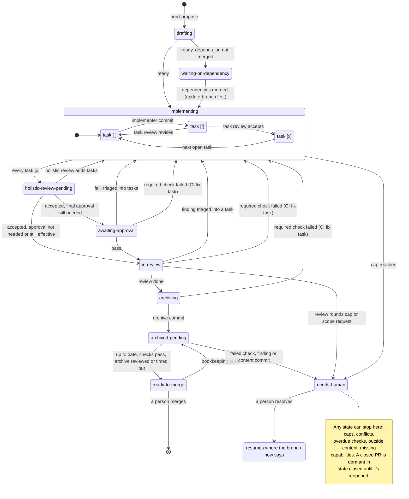

# Herd: unattended proposal → implementation → review → PR pipeline

This is the **project-agnostic** design. Nothing in it names a project's language, build tool, test runner or
release process; everything that does lives in each project's `.herd/` manifest (below) and in that project's
workflow doc for its people (see What a project knows about the herd).

## Goal and division of labor

Human time is spent at three points only: writing/refining a proposal (interactive, as today), the project's final
approval step if it has one (e.g. running end-to-end tests by hand, see Final approval), and merging the resulting
PR. Everything else — implementing `tasks.md` item by item, reviewing each task, iterating on review feedback,
fixing final-approval failures, archiving the spec delta, and opening the PR — runs unattended. A proposal that
the pipeline can't finish on its own stops in a `needs-human` state (see Escalation) instead of looping.

- **Proposer**: a human with an interactive cloud SOTA agent. Unchanged, plus one step: marking the proposal ready
  (see The hand-off).
- **Implementer**: an LLM run non-interactively, one task at a time. Which model is host config per worker slot, local
  (Ollama or similar), a rented GPU, or a cloud API, and one host can mix them (see Models).
- **Reviewer**: an LLM run non-interactively, by default cloud SOTA (Claude Code, `claude -p`), configured per worker
  slot like the implementer; a task review never runs on the model that wrote the commit (see Models). It reviews each
  task's commit and, once every task is accepted, the whole change holistically. Also triages the PR's review feedback
  into tasks (see Following up on PR review), and runs the archive step once final approval passes and review is done,
  since syncing spec deltas can need judgment.
- **Orchestrator**: plain code (no LLM, no LLM API key), owns the queue and git/GitHub plumbing — assigns work,
  creates/tears down working copies, starts worker containers, derives task/review state, pushes, opens and
  updates PRs. The orchestrator opens the PR and marks it ready, so it also watches the PR for review feedback until
  merge, and delegates each round of fixes to the workers (see Following up on PR review).

## What is generic and what is per project

One herd instance runs per host and serves every **registered project**. The split:

| Generic (the herd repo) | Per project (`.herd/` in the project's repo) |
|---|---|
| Orchestrator, state machine, queue, crash recovery | Toolchain image: what a worker needs to build and test (`toolchain.Dockerfile`) |
| Role layers: implementer harness, `claude`, `git`, `openspec` | Gate: the commands that must pass before a commit is accepted, and what the tamper guard protects |
| Role system prompts | Optional prompt additions per role (appended, never replacing) |
| Planner skills (`herd-propose`, `herd-ready`, `herd-resolve`), installed by `herd init` | A short workflow doc for the project's people: what's specific to them (see What a project knows) |
| Commit validation, push, PR lifecycle, update-branch | Network egress beyond the model endpoint (package registries) |
| Escalation markers, inputs request/provide cycle | Cache volumes (e.g. a build tool's dependency cache) |
| herdr bridge, event log, `herd` CLI | Final approval: `none`, or `human` with instructions |
| Model backends and secrets (host config) | Capabilities the toolchain lacks (tasks needing them escalate) |
| | Cap overrides; whether the reviewer writes release notes into the PR body |

The project's CI workflows, release automation and branch-protection choices are **not** part of the herd. The
herd only *requires* some of them to exist (see Requirements on a project) and `herd doctor` checks that they do.

**Workflow: OpenSpec only, for now.** The state machine reads OpenSpec's files (`.openspec.yaml`, `tasks.md`) and
runs its archive. "Project-agnostic" means any project that uses OpenSpec, regardless of language or platform. Keep
the OpenSpec-specific reads behind one module in the orchestrator (list changes, read the ready flag, read/write
task state, archive) so a second workflow is a new module, but don't build that abstraction further until a
project needs it.

## The project manifest

`.herd/project.yaml`, committed to the project's default branch. Example shape (a real one, with comments
explaining its values, is Driving Log's `.herd/project.yaml`):

```yaml
workflow: openspec
branch_prefix: change/
toolchain:
  dockerfile: .herd/toolchain.Dockerfile     # Debian/Ubuntu-based; the herd adds its role layer on top
  caches: [/home/agent/.gradle]              # per-project, per-role volumes
  egress:                                    # host[:port], 443 by default; always TLS
    [repo.maven.apache.org, maven.google.com, dl.google.com, plugins.gradle.org, services.gradle.org]
gate:                                         # implementer runs it before committing; reviewer re-runs it
  - ./gradlew check
  - openspec validate --all --strict
guarded:                                      # the tamper guard (see Who commits, who pushes)
  tests: ["**/src/test/**", "**/src/*Test/**"]  # deleting or emptying one needs a declared reason
  skip_markers: ["@Ignore", "@Disabled"]      # adding one needs a declared reason
  paths:                                      # any change needs a declared reason
    - config/detekt/**                        # lint config and baselines
    - "**/build.gradle.kts"                   # build configuration that defines what the gate runs
    - settings.gradle.kts
    - gradle/**
    - gradlew
final_approval:
  kind: human                                 # or: none
  instructions: |                             # shown in the herd's status pane and in the draft PR body
    Run the end-to-end suite for the areas this change touches; record pass/fail in review-notes.md.
missing_capabilities:                         # a task that needs one of these escalates instead of being attempted
  - macOS / Xcode
caps: { review_rounds: 3, added_tasks: 3, failed_attempts: 3, gate_fixes: 3, pr_review_rounds: 5 }
prompts:                                      # optional, appended to the generic role prompts
  implementer: .herd/implementer.md
  reviewer: .herd/reviewer.md
release_notes: true                           # reviewer writes a "Release notes" section into the PR body
pr_review:                                    # see Following up on PR review
  wait_for: [copilot-pull-request-reviewer]   # automated reviewers whose review of the content tip is awaited
  timeout: 15m                                # after this, a missing review is treated as none, shown in the status pane
  checks_timeout: 60m                         # a required check with no result by then escalates
```

**Defaults** for what a manifest leaves out: `caps` as in the example (3, 3, 3, 3 and 5), `pr_review.timeout: 15m` and
`pr_review.checks_timeout: 60m`.
They come from the first project's PRs before the herd existed: one PR took five Copilot rounds to come clean,
which sets `pr_review_rounds`, and Copilot re-reviewed about 2 to 4 minutes after each push, which a 15-minute
timeout covers with room for a slow round. The other caps are still guesses (see Open questions).

Project knowledge the agents need (conventions, where things live, test strategy) comes from the project's own
`CLAUDE.md`/`AGENTS.md` and `openspec/config.yaml`, which the harness reads like any interactive session would — the
manifest doesn't duplicate it.

**The manifest and toolchain are read from the default branch, never from a change branch.** Otherwise an agent
could widen its own egress or weaken its own gate. Commit validation also rejects any worker commit that touches
`.herd/`. Changing the manifest is an ordinary human PR.

## Requirements on a project

- Uses OpenSpec, with changes in `openspec/changes/`.
- Hosted on GitHub, with branch protection on the default branch requiring PRs, required CI status checks, and
  up-to-date branches (see Keeping up with the default branch). The CI checks should run the same gate as the
  manifest, as an independent second net.
- The gate runs headless in a Linux container. Anything that can't (a Mac, a device, a GUI emulator) is either
  the project's human final-approval step or a `missing_capabilities` entry.
- The default branch is **PR-only for everyone**, with no bypass. Nothing needs one: a proposal lives on its own
  branch from its first commit and reaches the default branch only as the one merge of its PR (see The hand-off).

## What a project knows about the herd

A product project knows as little as possible about how the herd works. All of the design (states, review loop,
recovery, containers) lives only here. A project carries:

- **`.herd/project.yaml` and `.herd/toolchain.Dockerfile`**: configuration, with the reasoning for its values
  in comments. It isn't documentation of the herd.
- **The planner skills**, installed and updated by `herd init` into the project's agent config (for Claude Code,
  `.claude/skills/`), the same way `openspec init` installs its skills. They are vendored and herd-managed, so a
  project doesn't edit them; project-specific rules go in the project's workflow doc, which the skills read.
  Herd is MIT-licensed so the vendored skills fit any project; `herd init` writes the license next to them
  (`.claude/HERD-LICENSE`), as OpenSpec does with its own.
  - `herd-propose <change>`: starts a proposal the herd's way. It creates `<branch_prefix><change>` from the default
    branch (in a worktree, so the person's main checkout is untouched), runs the project's propose workflow there,
    commits, pushes, and opens a **draft PR**, where the proposal is reviewed. Before proposing, it fetches the other
    change branches and lists what's in flight, so the planner can spot overlaps and record dependencies, and it
    removes the worktrees of merged changes (Cleaning up after merge).
  - `herd-ready <change>`: checks a proposal against Writing proposals for the herd (below) and the manifest's
    `missing_capabilities`, then sets `ready: true` in the change's `.openspec.yaml` **on its branch**, commits and
    pushes.
  - `herd-resolve <change>`: shows why a change is waiting on a human, helps fix it on the change branch, and
    commits the resolution: a resolved `needs-human` marker, or a final-approval pass/fail.
- **A short workflow doc for the project's people and planner agents.** It covers only what's specific to that
  project: its extra rules for herd-ready tasks, how to run its final approval, and what not to touch once a change
  is ready. For everything else it points to `using-the-herd.md` (the generic guide for people), never repeating
  it. The project's `CLAUDE.md`/`AGENTS.md` points to it.

## Writing proposals for the herd

These are the generic rules `herd-ready` checks. A project's workflow doc adds its own.

- **The proposal validates** (`openspec validate <change> --strict`) and is complete. The herd implements what's
  written and can't ask clarifying questions, apart from stopping at `needs-human`.
- **Each `tasks.md` item is one reviewable commit**: one coherent step that leaves the gate green, small enough for
  one review. Split items that aren't; merge items that can't pass the gate on their own.
- **Sections are in dependency order.** Tasks run strictly in sequence (see Concurrency model).
- **Nothing needs a `missing_capabilities` entry**, and no task *runs* the final-approval checks. Tasks may write or
  update those tests; running them is the human's final approval.
- **Outside content is committed with the proposal** (test fixtures, sample files) where it can be, so the herd
  doesn't stop and ask for it (see Outside content).
- **No task needs a secret.**

## Onboarding a project

1. `herd init` in the project's checkout. It writes `.herd/` with detected defaults and installs the planner
   skills. Review the files and land them by PR.
2. Add a CI workflow that runs the gate on every PR. Make it a required status check.
3. **(manual, repo admin)** Branch protection on the default branch: PRs required for everyone (no bypass), the CI
   check required, branches up to date before merging.
4. **Move proposals already on the default branch onto change branches**: one commit removes them from the
   default branch, and each gets `<branch_prefix><change>`, branched from that commit, holding only its own
   proposal. After that, the default branch's `openspec/changes/` holds only `archive/`.
5. Write the project's workflow doc (see What a project knows), and point `CLAUDE.md`/`AGENTS.md` to it.
6. `herd doctor <project>` until it passes.
7. **(manual)** Smoke test: run one small, low-risk proposal through the whole pipeline while watching the `herd`
   session, including one deliberate review rejection and one final-approval failure fed back, before trusting it
   with a real queue.

## Registering projects

The herd can start observing a new project at any time, without restarting anything.

- **Registering.** `herd init` registers the project it onboards. `herd add <repo-url>` registers a project that already
  has `.herd/` (for example, on a second host). Egress is TLS only, so a repository URL is normalized to HTTPS when it's
  registered (`git@github.com:owner/repo.git` becomes `https://github.com/owner/repo.git`), and any other scheme is
  rejected. Both write `/etc/herd/config.yaml` and poke the orchestrator (see The herd's own account). The `herd`
  account can only read that file on the host (see The herd's own account), so registering stays a host-side action that
  no worker agent or orchestrator bug can widen, even through the Podman socket. The operator's planner agent runs under
  their account and could run `herd add` too, but it's the person's own supervised session: a config change through it
  is theirs to approve, like any other command it runs.
- **Active is derived, not remembered.** On each scan, a registered project is *active* when its default branch has
  a `.herd/project.yaml` that parses, the herd's GitHub App is installed on the repo, the project's toolchain image
  builds, and the worker slots it may use can run every unit kind (see Models). Otherwise it's *inactive*, and the
  status pane says which check failed. Nothing records
  that `herd doctor` passed. `doctor` is the human's deeper check (gate in a real worker, branch protection, model
  backend) to run before trusting a project, not a switch the orchestrator reads.
- **First scan of a new project.** The orchestrator creates the project's bare mirror and builds its images. It
  then treats the project like any other: it queues change branches already marked `ready: true`, and leaves the
  others alone. The herdr bridge adds the project's workspace, with its planner pane, on its next pass.
- **GitHub access is the manual step.** The orchestrator acts on GitHub as the herd's own **GitHub App**,
  installed on selected repositories, so a new project needs the App installed on it (one step in GitHub's
  settings). `herd add`/`init` check this and say so when it's missing. Until it's done, the project stays inactive
  with "App not installed".
- **Pausing and removing.** `herd pause <project>` / `herd resume <project>` set `paused` in host config. A paused
  project gets no new work; a unit already running finishes and pushes. `herd remove <project>` unregisters it:
  running units for it are stopped (their work is discarded like any crashed attempt), and its mirror, caches and
  images are deleted. Its branches, PRs and `review-notes.md` stay on GitHub, so registering it again resumes
  exactly where it stopped.
- **Why not discover projects automatically** (e.g. every repo the App is installed on that has `.herd/`)? Because
  installing the App is about access, and registering is about intent: discovery would turn "the App can see this
  repo" into "the herd will push to this repo", which should stay an explicit choice.

## The hand-off: when a proposal enters the queue

**A change lives on its own branch for its whole life**, `<branch_prefix><name>` (`change/<name>`): proposal,
refinement, implementation, review, final approval and archive. The default branch never holds a change in progress.
It gets the change, code and archive together, as the one merge of the change's PR. So the default branch's
`openspec/changes/` holds only `archive/`, and its specs describe only what is built.

- **Proposing.** `herd-propose` (or a person by hand) creates the branch, commits the proposal there, pushes it, and
  opens a draft PR. Refining the proposal is more commits on the branch; the draft PR is where it's discussed.
- **The hand-off** is an explicit `ready: true` field in the change's `.openspec.yaml`, **committed on the change
  branch** (by `herd-ready`). A pushed branch without it is still being written, and the herd leaves it alone. The
  intake scan lists the remote's `<branch_prefix>*` branches and reads that one field on each. Like everything else
  here, it's read from git, not remembered.
- **Dependencies.** `depends_on: [<change>, ...]` in `.openspec.yaml` names changes that must be merged first. A
  ready change whose dependencies aren't all archived on the default branch waits (state *waiting-on-dependency*).
  When they are, its first unit of work merges the default branch in (see Keeping up with the default branch).
  Change branches never stack on each other.
- **Pausing.** Setting `ready: false` (or removing the field) on the branch stops the herd after the unit it's
  running, so a person can revise the change. Setting it back resumes from whatever the files then say.
- **A person pushing while the herd works.** The orchestrator's next push to that branch is rejected as
  non-fast-forward. It discards that unit like a crashed one, but records it as `superseded`, which isn't committed
  and doesn't count as a failed attempt (see Failed attempts), and the next scan derives the change's state from the
  new tip. Git enforces this, so nothing a person pushes can be silently overwritten.

## Concurrency model

- A proposal's tasks run **strictly sequentially** — `tasks.md`'s sections are a dependency chain in practice
  (storage → UI → cross-cutting logic → end-to-end tests → verification). Building scheduling for intra-proposal
  parallelism isn't worth it for v1.
- **Multiple proposals run concurrently**, across and within projects, each on its own branch
  (`<branch_prefix><name>`), each bound to at most one active worker at a time. The host's worker slots (see
  Models) cap the total; projects share them round-robin, so one project's backlog can't starve another.
- Each unit of work (one task's implementation, one round of addressing review feedback, or one review) gets a
  **fresh, ephemeral clone** of the proposal branch's current tip, taken from that project's local bare mirror (see
  Containers), handed to a new worker container, and deleted when that unit of work ends. The branch is the
  persistent state; the clone is disposable — this is what lets review feedback be picked up by a different
  worker than the one who wrote the original code.
- **Restarting a task always starts clean, never resumes.** If a task needs to be restarted — orchestrator crash,
  worker crash, a hung worker getting killed on timeout — whatever partial work existed in that attempt's clone
  is discarded outright: not diffed, not merged, not used as a starting point. The next attempt gets a brand-new
  clone of the branch's current (last-pushed) tip, exactly as if the task were starting for the first time. This
  is a deliberate rule, not just a side effect of clones being ephemeral — the temptation to "resume the
  half-finished diff instead of wasting the compute already spent" needs to be ruled out explicitly, since a
  resumed partial edit from a crashed/killed worker is exactly the kind of unverified state this design otherwise
  avoids by treating every attempt as a clean, reproducible function of (branch tip, task, review notes).
- **Commits are additive, never amended, rebased or force-pushed**, so the commit history is an honest review
  trail (implement → review → revise → review → accept) worth surfacing in the final PR body.
- The reviewer pins its verdict to the exact commit SHA it evaluated (recorded in a `review-notes.md` sibling to
  `tasks.md`), so a verdict never becomes ambiguous if the branch moves under it. Because history is never
  rewritten, these pins stay valid for the life of the branch.

## Who commits, who pushes

**Workers commit; only the orchestrator pushes.** A worker (implementer or reviewer) makes exactly one commit in
its clone per unit of work — so commit messages are written by the agent that knows what changed — and writes a
status file on exit. The orchestrator then validates the commit before pushing it:
- exactly one new commit on top of the tip the unit started from;
- the commit contains the expected state transition (see below) and nothing outside the change's scope (e.g. an
  implementer commit must not touch `review-notes.md` or flip a checkbox to `[x]`; no worker commit may touch
  `.herd/`);
- the status file agrees with the commit;
- the commit doesn't touch what defines CI on GitHub: `.github/workflows/` and `.github/actions/` (local actions the
  workflows use). Every other path under `.github/` (issue templates, Dependabot configuration, CODEOWNERS) is a
  **built-in** guarded path: the tamper guard treats it as if it were in `guarded.paths`, whatever the manifest says, so
  changing it needs a declared reason and the reviewer's acceptance. CI is the independent second net, so the herd's App
  isn't granted GitHub's `workflows` permission, and a task that needs a CI change escalates. CI still runs the
  repository's own build, though, so anything outside `.github/` that defines what the gate checks can weaken both nets
  at once: scripts a workflow calls, and the build configuration itself (for Gradle, the build scripts, settings,
  wrapper and lint configuration, since editing `build.gradle.kts` can drop tests without touching a test file). All of
  it belongs in the project's `guarded.paths`, so changing it is allowed but needs a declared reason and the reviewer's
  explicit acceptance. `herd init` proposes that coverage for the build tool it detects, and `herd doctor` warns, best
  effort per toolchain, about a workflow-referenced script or build configuration file that isn't covered. CI is
  independent of the herd's own infrastructure, then, and of the repository only as far as the guard covers it;
- **the tamper guard**, for implementer commits: the commit doesn't weaken the safety net silently. Deleting or emptying
  a file matching the manifest's `guarded.tests`, adding one of its `guarded.skip_markers`, or changing a
  `guarded.paths` file (a lint baseline, say) must each be declared, with a reason, under a `Guarded:` section of the
  commit message. The task review must then accept or reject each declared item, and validation of the verdict commit
  checks that it does. An undeclared one fails validation before any review is spent. Legitimate cases (removing a
  feature removes its tests) still pass, but never silently. Assertions weakened into tautologies need judgment, so
  catching them stays with the reviewer. (The idea comes from no_human, see Prior art.)

  The format is fixed, so validation never has to interpret prose. In the commit message, one line per item:

  ```
  Guarded:
  - G1 delete "shared/src/commonTest/kotlin/vehicle/HidingTest.kt": task 2.3 removes vehicle hiding
  - G2 change "config/detekt/baseline.xml": the renamed class keeps its two existing findings
  - G3 skip "shared/src/commonTest/kotlin/fuel/OcrTest.kt" x2: both cases need the camera fake from task 4.1
  ```

  `- <id> <action> <path>[ x<n>]: <reason>`, where the id (`G1`, `G2`, …) is unique within the commit, the action is
  `delete`, `empty`, `skip` or `change`, one per guard rule, and the path is a JSON string, so any valid Git path (one
  containing ` x2` or `: `, say) parses unambiguously. There's one declaration per action and path; a `skip` declaration
  covers every marker added to that file and gives their number (`x2`). The orchestrator computes the guarded items from
  the diff itself and requires a one-to-one match on action and path, and on the count for `skip`. The task review
  answers each in `review-notes.md` as `guarded <commit sha> <id>: accept|reject — <reason>`. Each task review gives
  exactly one decision per item it covers, validation of the verdict commit checks that, and when an item has decisions
  from several reviews (a reject, then a later accept), the latest in git order governs. A rejected item sends the task
  back to `[ ]` like any revise verdict, and **stays open**: the next attempt starts on top of the rejected commit, so
  leaving the file alone would leave the rejected change in place. A task can't be accepted while any of its guarded
  items is open. An item closes when a later commit of the task demonstrably reverses it (the file restored to its
  content before the task, the skip markers gone, the guarded path back as it was), which the orchestrator checks from
  the diff, or when a later task review explicitly accepts its current state (a new `guarded <commit sha> <id>: accept`,
  naming the original commit). Every open item is in scope for each later task review of the task. Validation of an
  accept verdict refuses while any item is open.

  The guard covers implementer commits because those are the ones a task review follows. Reviewer commits are
  held to a narrow scope instead, so they can't touch guarded files at all: a verdict or triage commit only
  `tasks.md` and `review-notes.md`, an archive commit only what `openspec archive` changes under `openspec/`.
  `herd doctor` flags a `guarded` pattern that reaches into `openspec/`, where it would collide with the archive.


**Requests travel in the commit message**, never in the status file, which is discarded with the clone. An
implementer that needs something it can't do itself lists each need under a `Requests:` section of its commit
message, in the same fixed format as `Guarded:`:

```
Requests:
- R1 prereq "add a migration for the receipts.amount column": the importer can't write it without one
- R2 input "sample-receipt.jpg": a real receipt photo for the OCR fixture
```

`- <id> <kind> <subject>: <why>`, where the id (`R1`, `R2`, …) is unique within the commit, the subject is a JSON
string, and the kind is one of:
- `prereq`: a task that has to come before this one;
- `followup`: a task for later, which doesn't block this one;
- `input`: outside content (the subject names the file);
- `capability`: something the pipeline lacks.

When the task can't go further without it, the commit is **request-only**: no code, just the task's checkbox
flipped to `[r]`, so the reviewer picks it up through the ordinary task review and the task model stays `[ ]` /
`[r]` / `[x]`. That review answers each request in `review-notes.md` as
`request <commit sha> <id>: added|needs-human|refused — <reason>`, and validation of the verdict commit requires
exactly one answer per request id. What happens to the requesting task follows from the answers:
- **`added` for a `prereq`**: the reviewer inserts the new task directly above the requesting one in `tasks.md`
  (marked "(added during apply)"), and the requesting task goes back to `[ ]`. Tasks run in file order, so the
  prerequisite runs first.
- **`added` for a `followup`**: the task is appended under "(added during apply)". The requesting task is judged
  on its own work as usual: accepted if a normal commit carried the request, back to `[ ]` if it was request-only.
- **`needs-human`** (an `input` or `capability`): the reviewer records the marker, the requesting task goes back
  to `[ ]`, and the change stops until a person resolves it.
- **`refused`**: the requesting task goes back to `[ ]`, with the reason in `review-notes.md` for the next
  attempt.

The status file only reports how the unit ended.

A commit that fails validation is discarded like any crashed attempt, and recorded as one (see Failed
attempts). Worker containers never hold GitHub credentials; the orchestrator's GitHub App key is the only
push-capable credential in the system.

**The orchestrator's own commits** are bookkeeping only: generated by plain code in a fixed format, never written
by a model, and touching only the file each names. The complete list:
- **a failed attempt's record** in `review-notes.md` (below);
- **a mechanical `needs-human` marker** in `review-notes.md`, for the escalations that need no judgment: a cap reached
  (`caps.review_rounds`, `caps.failed_attempts`, `caps.gate_fixes`, `caps.added_tasks`, `caps.pr_review_rounds`), an
  update-branch conflict, a required check past `pr_review.checks_timeout`, and the three post-archive cases in
  *archived-pending* (a failed check, an open review finding, a non-bookkeeping commit). Escalations that need judgment
  (a request for outside content, holistic feedback that maps to no task, a finding the reviewer can't map to a task)
  are written by the reviewer in its verdict commit;
- **an `inputs.md` entry** for content provided through `herd provide` (see Outside content).

Everything else on a change branch is a worker's commit, a person's, or an update-branch merge.

**Failed attempts.** A unit that ends without an accepted commit (the worker crashed or timed out, couldn't get the gate
green, or its commit failed validation) leaves nothing in the branch, so on its own it would be retried forever. The
orchestrator therefore commits a line to `review-notes.md`, pinned to the tip the unit started from, with its fields as
one JSON object so that no subject or reason text can make it ambiguous:
`attempt-failed: {"kind": "implement", "subject": "3.2", "reason": "gate", "from": "<sha>"}`. The subject is the task
for `implement` and `task` units, and the change itself for `holistic`, `triage` and `archive` units. The count of those
lines for one unit kind and subject is derived from git like everything else, counting since the later of two points:
that kind's last accepted commit for that subject, and the resolution of a failed-attempts `needs-human` marker for it,
so a person who resolves the escalation gives the unit a fresh set of attempts instead of an immediate re-escalation.
When the count reaches `caps.failed_attempts` the change escalates to `needs-human` before another attempt starts (with
the default of 3, three failed attempts, not four).

A unit whose push lost the race to a person's push is `superseded`, not failed: it says nothing about the worker or the
change, so it's retried from the new tip, isn't committed and doesn't count. Failures of the herd's own infrastructure
(the model backend unreachable or rate-limited, the host out of disk) are similar: they say nothing about the change, so
they're **not** committed. They go to the event log, don't count toward the cap, and back off. If they persist past
`alerts.infra_after` (host config), the operator gets an alert, so a long outage shows up once instead of as a growing
branch history that retriggers CI and review.

## Communication and the work queue: git + files, no message bus, no separate durable store

No queue service, no database. The queue is **derived from git on every orchestrator start**, not persisted
independently:
- `.openspec.yaml`'s `ready: true` on each change branch is the intake queue, and its `depends_on` the ordering
  (see The hand-off).
- `tasks.md` checkbox state (`[ ]` / `[r]` awaiting review / `[x]` accepted) is the task queue itself. `[r]` is
  OpenSpec-compatible: its parser counts only `x` as done, so `openspec list` and `openspec archive` treat `[r]` as
  still open, which is correct.
- `review-notes.md` (new, per change) carries reviewer feedback back to whichever worker picks up the task next,
  the final-approval result, and any `needs-human` marker. The implement→reject→revise sequence visible in the
  branch's commit history is how many review rounds a task has had — not a separate counter.
- Whether a proposal's PR exists, whether it's still a draft, and whether it was merged or closed unmerged, is answered
  by asking GitHub for PRs in every state
  (`gh pr list --head <branch> --state all --json number,isDraft,state,mergedAt`), not remembered. The default lists
  only open PRs, which would make a closed one look like no PR at all, so *closed* couldn't be derived and the herd
  might open a second PR.
- The set of registered projects is host **config** (`/etc/herd/config.yaml`), not state: it's written by
  the `herd` CLI, never by the orchestrator, and re-read on every scan (see Registering projects).

The only state that lives purely in the orchestrator process's memory — and is allowed to vanish on crash — is the
*current assignment lock* (which worker container currently holds which proposal), whose only job is to stop two
workers racing on the same branch while the process is alive.

**The scan loop.** The orchestrator doesn't keep a work list between passes. It runs the same full scan on start and
then repeatedly: every few minutes (`scan_interval` in host config), and right away when the `herd` CLI pokes it after
changing the config or recording a human action. Each scan re-reads the host config, fetches every registered project's
bare mirror, derives each proposal's state, and dispatches work to free worker slots. A project, a proposal or a human
fix that appeared since the last pass is picked up by the next one with no restart, because no proposal state is
remembered between passes to go stale. Crash recovery (below) is just the first scan. The only things the orchestrator
keeps across passes are operational stores that decide nothing about any proposal: the budget counter and usage ledger,
the alert queue (see Monitoring), and retained snapshots of removed or changed rented machines (see Rented GPU
backends). It reads them back on start.

**Crash recovery** (orchestrator container restart or a full host reboot look identical from here, given its systemd
unit's `Restart=always` and lingering, see Containers): on start, the orchestrator, for every registered project, (1)
lists every change branch without a merged PR, (2) reads each one's `.openspec.yaml` and `tasks.md`/`review-notes.md` to
compute its exact next action from scratch — no assumption carried over from before the crash, (3) reconciles against
running containers (kill any orphaned worker or model pull rather than adopt it — its state is suspect — and wait for a
pull to exit before local dispatch resumes; the model server alone is adopted) and `gh pr list` (don't open a second PR
for a branch that already has one), (4) reads back the operational stores (budget counter, usage ledger, alert queue,
retained rented-machine snapshots) and starts a new proxy epoch (see Network and secrets), (5) re-enqueues and resumes.
The cost of a crash is bounded to whatever unpushed work was sitting in a worker's ephemeral clone — redone from the
last pushed commit (and, per the rule above, that redo never reuses the discarded partial work) — which is cheap
specifically because workers are stateless and task granularity is small (one `tasks.md` item at a time).

**The proposal states at a glance.** A summary of the state list below, which is the authority: the diagram leaves out
*closed* (a closed PR is dormant until it's reopened) and most of the ways a change can stop at *needs-human*.



**The guarantee that a started-but-unfinished task can never be missed on restart** — not just redone, but never
silently dropped — comes from two rules together, not from the scan alone:
- Every state transition is a **single commit, pushed as a unit**. An implementer's "done" flips `tasks.md`'s
  checkbox to `[r]` *in the same commit* as the code change; a reviewer's verdict flips it to `[x]` (or back to
  `[ ]` with `review-notes.md` updated) *in the same commit* as writing its notes. A commit that never got pushed
  doesn't exist as far as recovery is concerned — it was in an ephemeral clone and is discarded. This rules out a
  4th, invisible in-between state — e.g. code pushed but still marked `[ ]`, which would make a restart redispatch
  it as unstarted and duplicate work on top of what's already there, instead of cleanly treating it as awaiting
  review.
- The state space is **exhaustive and structurally derived**, both per-task and per-proposal, so recovery is a
  total function of current facts, never a remembered checkpoint. Per task: `[ ]` / `[r]` / `[x]`, nothing else
  possible. Per proposal, checked in this order (first match wins):
  0. *closed* — the change's PR is closed without being merged. Next action: none, whatever else the files say; the
     change is dormant until the PR is reopened (its branch is kept, see Cleaning up after merge), and closing is
     what starts its log retention (see Monitoring). A reopened PR re-enters the list below from whatever its files
     then describe.
  1. *needs-human* — `review-notes.md` on the branch carries an unresolved `needs-human` marker (see Escalation).
     Next action: none; shown in the herd's status pane until a human resolves it.
  2. *drafting* — change not archived, no `ready: true` in the change's `.openspec.yaml` on its branch. Not queued;
     shown in the status pane as in flight, so planners and people can see it.
  3. *waiting-on-dependency* — change not archived, ready, but a change in its `depends_on` isn't archived on the
     default branch yet. Next action: none until it is.
  4. *implementing* — ready, dependencies merged, change not archived, ≥1 task not `[x]`. This includes tasks appended
     after a final-approval failure, even when a draft PR already exists. Next action: if the branch doesn't yet contain
     the default-branch commit that merged each of its `depends_on` changes, update-branch first (see Keeping up with
     the default branch), so no task runs against a tree without its dependencies; otherwise the next open task, in file
     order.
  5. *holistic-review-pending* — every task `[x]`, no **current** holistic-accept in `review-notes.md` (see
     below), change not archived.
  6. *awaiting-approval* — holistic review accepted, `final_approval.kind: human`, the effective final-approval record
     (see below) isn't a pass, change not archived. Next action, the first that applies: a required check is past
     `pr_review.checks_timeout` with no result, so the orchestrator escalates (see Failing checks before the archive); a
     required check failed on the current tip, so CI triage (see Failing checks before the archive); the effective
     record is a `fail` not yet triaged, so a `triage` unit (see Final approval); otherwise ensure a PR exists (a
     **draft**, unless it was already marked ready before a `rerun`; it isn't turned back into one), and the human runs
     the project's final approval. Skipped entirely when `final_approval.kind: none`.
  7. *in-review* — holistic review accepted and (if required) the effective final-approval record a pass, change not
     archived, and review isn't done: the PR has unresolved review threads, a review requesting changes, a review
     finding not yet triaged, an awaited reviewer (`pr_review.wait_for`) that hasn't reviewed the content tip (see
     below) yet while its review window (see below) hasn't timed out, or an awaited reviewer's first review of the
     content tip that no `triage` unit has classified yet. The orchestrator runs no model and can't tell a clean review
     from one with findings only in its free-form summary, so every such review is classified (`clean`, or findings
     triaged), before the archive as after it. Next action, the first that applies: a required check is past
     `pr_review.checks_timeout` with no result, so the orchestrator escalates (see Failing checks before the archive); a
     required check failed on the current tip, so CI triage (see Failing checks before the archive); otherwise mark the
     PR ready for review if it's still a draft, then follow up as Following up on PR review describes. A triaged finding
     becomes a task under "(added during review)", which sends the change back to *implementing*. Review comes before
     archiving, because a fix after the archive would mean editing the synced main specs by hand.
  8. *archiving* — holistic review accepted, (if required) the effective final-approval record a pass, review done (no
     open thread or untriaged finding, and every awaited reviewer's first review of the content tip either classified
     clean or with all its findings triaged and resolved, or timed out), change not yet archived on the branch. Next
     action, the first that applies: a required check is past `pr_review.checks_timeout` with no result, so the
     orchestrator escalates (see Failing checks before the archive); a required check failed on the current tip, so a
     `triage` unit turns it into a fix task (see Failing checks before the archive); the branch is behind the default
     branch, so update-branch (a merge that touches the change's files sends it back through holistic review, which is
     still possible before the archive); while a required check is still running, none; wait (a failure then goes
     through Failing checks before the archive, never past it). Once the branch is up to date and every required check
     on its tip has passed, the reviewer runs the archive and commits. A crash mid-archive never gets pushed, so it's
     discarded with the clone and redone, same as any other unit of work.
  9. *archived-pending* — archive commit pushed, change not yet *ready-to-merge*. Every archived change that isn't
     ready is here, and its next action is the first of these that applies, in this order:
     1. a check failed or is past `pr_review.checks_timeout` with no result, a review finding is open, or a
        non-bookkeeping commit arrived after the archive: the
        orchestrator commits a mechanical `needs-human` marker (state 1 then matches). None of these can become a
        task, because fixing anything after the archive would mean un-archiving;
     2. the branch is behind the default branch: update-branch (see Keeping up with the default branch), even while
        checks are still running, since the merge restarts them anyway;
     3. an awaited reviewer's first review of the content tip, not yet classified: a `triage` unit, which records it
        as `clean` or as a finding in `review-notes.md` (a bookkeeping commit, so the content tip doesn't move). The
        orchestrator runs no model, so it can't tell a clean review from one with findings in its free-form summary;
        only a classified-clean review counts;
     4. checks still running on the current tip, or an awaited reviewer hasn't reviewed the content tip and its
        review window hasn't timed out: none; wait.
  10. *ready-to-merge* — archive commit pushed, branch up to date with the default branch, checks passing on the current
     tip, every awaited reviewer's review of the content tip either classified clean or with all its findings triaged
     and resolved (or timed out), no open thread, and the holistic-accept still current (see Current records). Next
     action: none; a human merges. A later bookkeeping push (a clean update-branch merge, say) moves the change back to
     *archived-pending* until checks pass on the new tip; its review of the content tip still stands.

  **Current records.** A holistic-accept is pinned to the SHA it evaluated, and recording it is itself a commit, so
  "for the current tip" could never hold. A holistic-accept is *current* when every commit since its SHA is
  **bookkeeping** (a final-approval pass follows its own rule, the effective record below):
  - a commit that touches only `review-notes.md` (verdict lines, failed-attempt lines, final-approval records,
    PR triage notes) or only `inputs.md`;
  - the validated archive commit, whose content `openspec archive` determines (see Who commits, who pushes);
  - an update-branch merge from the default branch that merged cleanly **and** brought in no change to a file the
    change itself touches. Default-branch changes elsewhere can still interact with the change, but CI re-runs
    the gate on the merge; changes to the change's own files are close enough to need another look.

  Any other commit (a fix task's code, a person's content push, an update-branch merge that touches the change's files)
  makes the holistic-accept stale, so the change returns to *holistic-review-pending*, and once archived, to
  *archived-pending* with the merge treated as a review finding. A final-approval pass isn't made stale by later
  fixes on its own: the holistic review that follows them records `final-approval: rerun` when the fixes touch what
  final approval covers.

  **The effective final-approval record** is the latest of the change's final-approval records in git order: a
  `pass`, a `fail`, or a `rerun`. History is additive, so an old pass stays in `review-notes.md`, but only a pass
  that's newer than any `rerun` or `fail` counts; after a `rerun`, the change goes back to *awaiting-approval* until
  a person records a new pass.

  **The content tip** is the branch's latest non-bookkeeping commit, except that the archive commit always counts as
  content here: it's bookkeeping for keeping the holistic-accept current, but its generated spec changes still need an
  awaited reviewer to see them, so after the archive the content tip is the archive commit (or a later non-bookkeeping
  one). Checks are judged on the current tip, since GitHub runs them on every push, but awaited reviews are judged on
  the content tip: a review of it, or of any later commit, counts, and the first such review from each awaited reviewer
  is the one that's classified, even when it's attached to a later bookkeeping commit. Otherwise review couldn't
  converge, because recording a review's classification is itself a push that the automated reviewer reviews again,
  which would need classifying in turn. Later reviews of bookkeeping-only tips, after that first one, don't block
  anything; a thread they open is still an open thread (that needs no model to see), but a finding only in such a
  review's summary isn't waited for, before the archive or after it, including in *ready-to-merge*: an accepted
  trade-off since it reviews the same content, and triaging every such review would bring back the loop above. So after
  the archive, what escalates is an open thread, a finding in a review of the content tip, a failed check or a
  non-bookkeeping commit; a summary-only finding in a later review of a bookkeeping tip doesn't.

  **The review window** for an awaited reviewer opens at the later of two moments: the content tip's push, and the PR
  being marked ready for review. A draft PR isn't reviewed, so a content tip pushed during holistic review or final
  approval starts its window only when the herd marks the PR ready. `pr_review.timeout` counts from that opening,
  wherever this document says a review timed out. A timeout stands in for a review only while none exists: once a
  qualifying review of the content tip arrives, even after its window timed out, it has to be classified clean like any
  other, and until it is, the change isn't *ready-to-merge* (it's back in *archived-pending*, or in *in-review* before
  the archive).

  **Failing checks before the archive.** In states 6–8, a required check that failed on the current tip comes first: the
  next action is a `triage` unit, which turns the failure into a fix task under "(added for CI)", sending the change
  back to *implementing*. Those tasks count toward `caps.gate_fixes`; past it, the orchestrator escalates. This is the
  path for a CI failure after an update-branch merge too (see Keeping up with the default branch). A required check that
  still has no result `pr_review.checks_timeout` after the push it's for (queued, running or merely expected) doesn't
  wait forever: the orchestrator commits a mechanical `needs-human` marker and alerts, before the archive or after it,
  since a stuck CI is for a person to look at.

  Because every branch is always in exactly one of these states and each has a defined next action, a full scan
  over all open branches cannot skip anything — there's nothing outside the enum for a task or proposal to
  silently fall into.

This forces every multi-step git/GitHub operation (push, open-PR, mark-ready, update-branch) to be written as
check-before-act/idempotent rather than blindly re-run — needed anyway for ordinary network failures, so crash
recovery exercises the same code path rather than a separate one. It also means recovery must always be a **full**
re-scan of every open branch, never a delta/"resume from last known position" scheme — a remembered checkpoint is
itself exactly the kind of state that could be lost in the same crash, which would reintroduce the missed-task risk
this design is meant to rule out. Deliberately not reaching for Redis/SQLite/a job queue here: a second source of
truth that can drift from git's would undercut the property that git is the only infrastructure dependency this
whole design has. Revisit only if rescanning branches on startup becomes slow with many projects and concurrent
proposals.

## Adding tasks mid-apply

Changes sometimes grow tasks during apply, so the pipeline allows it, narrowly:
- **Only the reviewer adds tasks**, as part of a verdict commit, marked "(added during apply)": appended at the end,
  or inserted directly above the task that needs it as a prerequisite (see Who commits, who pushes).
  The implementer can only *request* one, in its commit's `Requests:` section; the reviewer decides in the task's
  review (see Who commits, who pushes).
- Tasks fixing final-approval failures are appended the same way, under "(added during final approval)", and so are
  tasks for GitHub review comments, under "(added during review)" (see *in-review*).
- Added tasks count toward the per-proposal cap (`caps.added_tasks`); appending past it escalates to
  `needs-human` instead, since that much scope drift means the proposal itself needs revisiting.
- Fix tasks for failing checks, under "(added for CI)", are bounded by `caps.gate_fixes` instead of
  `caps.added_tasks`, so that dedicated cap is what governs CI retries.
- Tasks added during review are bounded by `caps.pr_review_rounds` instead of `caps.added_tasks`: one review round
  can raise several findings, and a finding fixed by class is still one task, so the count of rounds is what shows
  a change isn't converging.

## Escalation: the `needs-human` state

A proposal stops and waits for a human when any of these happens:
- a single task reaches the review-round cap (`caps.review_rounds`);
- the added-tasks cap is exceeded (above);
- PR review runs past `caps.pr_review_rounds` rounds without coming clean, or raises a finding the reviewer can't
  map to a task (see Following up on PR review);
- merging the default branch into the change branch conflicts (see Keeping up with the default branch);
- a unit's failed attempts (crash, timeout, red gate, rejected commit) reach `caps.failed_attempts` (see Failed
  attempts);
- a required CI check keeps failing before the archive (after an update-branch merge or otherwise) past
  `caps.gate_fixes` fix tasks (see Failing checks before the archive);
- the holistic review rejects with feedback that can't be mapped to a specific task;
- a task needs something in the manifest's `missing_capabilities`, or anything else the pipeline doesn't have (a
  device, a credential, a change to CI workflows), or content from outside the project (see Outside content);
- after the archive commit, a check fails, a review finding arrives, or a non-bookkeeping commit lands (see
  *archived-pending*).

The marker is a committed line in `review-notes.md` (`needs-human: <reason>`, pinned to a SHA like any verdict),
so the state is derived from git like everything else. The human resolves it by fixing whatever's wrong (editing
`tasks.md`, resolving the conflict, revising the proposal) and committing the marker as resolved on the branch
(`herd-resolve` does the bookkeeping); the next scan picks the proposal back up from whatever state its files now
describe.

## Final approval

The gate runs inside the workers. Some checks don't fit there — typically end-to-end tests that need an emulator,
a device or a GUI — and suit a human final check better. A project opts in with `final_approval.kind: human`.
Tasks that *write* those tests are still implemented and reviewed like any other task; only *running* them is
deferred.

When a proposal reaches *awaiting-approval*, the orchestrator makes sure its **draft** PR exists (normally opened by
`herd-propose` at proposal time) and puts in its body the
manifest's `final_approval.instructions`. The human checks the branch out, follows them, and records the result in
`review-notes.md`, pinned to the SHA tested (`herd-resolve` writes the entry):
- **pass** → the proposal moves to *in-review* (GitHub's review of the PR), and from there to *archiving* once no
  review thread is open;
- **fail** → the human writes the failure as the note. While that `fail` is the effective record and hasn't been
  triaged, *awaiting-approval*'s next action is a `triage` unit: the reviewer turns it into appended task(s) under
  "(added during final approval)" and records `final-approval-triaged <sha of the fail record>`, and the proposal goes
  back to *implementing*. Once those tasks are accepted and the holistic review is current again, the change returns to
  *awaiting-approval* with the `fail` already triaged, and the next action is the human again. The draft PR stays open
  throughout and simply gets more commits.

Archiving happens only after the pass and the review, deliberately: `openspec archive` syncs the spec deltas and
moves the change directory, so feeding failures or review feedback back as new tasks after an archive would mean
un-archiving.

## Following up on PR review

The orchestrator opens the change's PR and marks it ready for review, so it is also the one that watches the PR until
it is merged and follows up on what reviewers say. It runs no model, so it doesn't judge feedback. It collects
feedback, hands it to the reviewer to triage, has implementers fix it, and posts the answers. Every step is a unit of
work like any other, derived from git and GitHub on each scan; no proposal state is remembered.

1. **Watch.** Every scan, for each PR in *in-review* or later and not yet merged, the orchestrator reads:
   - the review threads (`reviewThreads` over GraphQL, with `isResolved`), every page of them: a check that reads only
     the first page can miss an open thread;
   - the reviews, bodies included: an automated reviewer often puts findings in its summary, with no thread (for
     Copilot, "Previously missed" and "In code that hasn't changed since last review");
   - the PR's conversation comments;
   - which commit each review covers (`commit_id`).

   Automated reviewers review again after every push, a few minutes later. So review is done only when every reviewer in
   `pr_review.wait_for` has reviewed the **content tip** (see the state list), or its review window (opened by that
   push, or by marking the PR ready if later) has timed out without one (a missing review then counts as none, and the
   status pane says so), and nothing is left open. Replies the herd itself posted don't count as reviews; filter by
   author and commit, not by the number of reviews. The herd posts as its GitHub App (`<app>[bot]`), so its replies
   never look like a person's comments; with a personal token they would, and filtering by author would drop the
   person's real feedback.
2. **Triage (reviewer).** New findings go to a reviewer unit together with the change, so the reviewer can check each
   claim against the code and the upstream sources it names. For each finding it decides one of:
   - *fix*: it appends a task under "(added during review)". Where the finding is one instance of a class (a missed
     file in an inventory, a wrong copyright line), the task covers the whole class, checked across the change, so
     the next review round doesn't find the next instance;
   - *no change*: it writes the reason.

   The decision goes in `review-notes.md`, keyed by the finding's id (thread id, or review id plus index for a
   finding in a summary), so a finding is triaged exactly once.
3. **Fix (implementers).** The added tasks go through *implementing* like any other task, task review included. A
   fix that changes behavior also updates the change's spec deltas, design and tasks.
4. **Answer (orchestrator).** Once a finding's task is accepted, or its no-change reason recorded, the orchestrator
   posts the reply the reviewer wrote, naming the fixing commit, and resolves the thread. A finding with no thread is
   answered in one PR comment per review round. Workers hold no GitHub credentials, so replies are always posted by
   the orchestrator, from text in `review-notes.md`.
5. **Repeat.** A round is counted once each time the change comes back to *in-review* with a new content tip, after
   the whole batch of fixes from the previous round has been implemented and accepted, not per commit along the way.
   Bookkeeping update-branch merges (see Current records) and the herd's own records don't move the content tip, so
   they don't count; a merge that touches the change's own files does. A change past that many
   rounds without coming clean, or a finding the reviewer can't map to a task, escalates to `needs-human`.

Feedback from a person is handled the same way. A request to change the proposal's scope rather than its
implementation is escalated, not triaged: scope is the proposer's call.

## Keeping up with the default branch

No rebasing (that would rewrite SHAs and break the reviewer's pins and the additive-history rule). Instead,
branch protection requires PR branches to be **up to date** before merging, and the orchestrator uses GitHub's
update-branch (`gh api -X PUT repos/<owner>/<repo>/pulls/<n>/update-branch`, a merge commit) when the PR is
behind. That merge triggers the CI checks again, which is where two concurrent proposals that both touched a shared
file (a dependency catalog, `CLAUDE.md`, a shared spec) actually collide — per-task testing alone won't catch that.
A conflicting update-branch escalates to `needs-human`; a CI failure after the update gets a fix task (see Failing
checks before the archive), and escalates past `caps.gate_fixes` of them. A clean update-branch merge that brings in no
change to the change's own files is bookkeeping (see Current records), so it doesn't make a holistic-accept or
final-approval pass stale: CI re-runs the gate, and the human re-runs final approval at their discretion. One that does
touch the change's files sends it back through holistic review against the merged tip.

## Cleaning up after merge

A worktree or branch that no longer has a use is removed, so in-flight work stays easy to read: the change branches
are the queue, and a stale one looks like work. Within the herd, the per-unit clones are already deleted after each
unit (Containers), so what lingers is a change's branch and a planner's worktree.

- **Once a change's PR is merged**, the orchestrator deletes its change branch on GitHub (unless the repository
  already deletes head branches on merge) and prunes it from the bare mirror, on the scan after the merge. A merged
  branch has no state in the enum, so nothing would ever pick it up again.
- **A PR closed without merging** keeps its branch: it may be reopened or reworked. The branch is removed only when
  a person says the change is abandoned (`herd-resolve`), never because of the close alone.
- **Planner worktrees** live on the person's machine, which the orchestrator can't reach (it has no host mounts).
  `herd-propose` made them, so the planner skills clean them up. Each run of `herd-propose` and `herd-resolve`
  first lists the project's worktrees whose branch has a merged PR whose head commit (`headRefOid`) is exactly the
  local branch's tip, and removes them with their local branches. A remote branch being gone isn't enough (it's
  deleted on every merge), and neither is `git branch --merged` (it doesn't recognize squash merges); a local tip
  that differs from the merged head has a commit the PR never got. It skips a worktree with uncommitted or untracked changes
  (gitignored local files such as SDK paths and config are fine to drop) and asks about it. The branch is deleted
  with `git branch -D`, not `-d`: a squash merge leaves the branch's own commits off the default branch, so `-d`
  refuses even after the check above passed. Then `git fetch --prune` drops the deleted remote branch.
- **Nothing with unmerged commits is deleted** without a person's say-so: a branch is removed only when it is merged
  or a person abandoned it, and a worktree only when its branch is.

## Models

Which model runs a unit is the operator's cost and privacy decision, so it's host config
(`/etc/herd/config.yaml`), never the project manifest. Named **backends** say what a model is; **worker slots**
say which backend runs which kind of unit:

```yaml
backends:
  opus:        { kind: anthropic, model: claude-opus-5-5,   secret: ANTHROPIC_API_KEY,
                 price: { input: <per Mtok>, output: <per Mtok> } }   # budget.currency; input = highest input rate
  sonnet:      { kind: anthropic, model: claude-sonnet-5-5, secret: ANTHROPIC_API_KEY,
                 price: { input: <per Mtok>, output: <per Mtok> } }
  local-coder:    { kind: ollama, model: <coder model>,   endpoint: http://ollama:11434 }
  local-reviewer: { kind: ollama, model: <another model>, endpoint: http://ollama:11434 }
  rented-coder:   { kind: openai, machine: h100-a, model: <open-weight coder>, revision: <commit>,
                    context: 131072 }      # see Rented GPU backends
machines:                              # rented GPU machines: what's billed, once per machine
  h100-a: { endpoint: https://<rented host>/v1, access: https-key, secret: RENTED_GPU_KEY,
            price: { per_hour: <rate> }, idle_alert: 30m }
  # with access: wireguard instead, endpoint: http://10.66.0.1:8000/v1 (the tunnel address) and the machine adds:
  #   wireguard: { peer: <public host>:51820, peer_public_key: <key>, address: 10.66.0.2/32,
  #                allowed_ips: 10.66.0.1/32, private_key_secret: RENTED_WG_KEY }
slots:                                 # each slot runs one unit at a time
  - name: gpu
    implementer: local-coder
    reviewer: { archive: local-coder }  # only the unit kinds listed run here
  - name: gpu-private
    projects: [some-project]            # reserved: only these projects' units run here
    implementer: local-coder
    reviewer: local-reviewer            # a different model, so it may review local-coder's work
  - name: cloud-1
    implementer: sonnet
    reviewer: { task: sonnet, holistic: opus, triage: opus, archive: sonnet }
  - name: cloud-2
    implementer: sonnet
    reviewer: opus                      # one backend for every reviewer unit kind
planner: { agent: claude }              # the interactive agent in each project's planner pane (see herdr)
projects:
  some-project:
    checkout: ~/src/some-project        # the operator's checkout, for its herdr workspace (herd init fills it in)
    locality: host                      # optional: the herd's agents send its code to no cloud or rented backend
    slots: [gpu, gpu-private]           # optional: the slots this project may use
```

A role maps to one backend, or to one per **unit kind**. The implementer has one kind (`implement`). The reviewer
has four that need very different judgment: `task` (one task's commit), `holistic` (the whole change, plus release
notes), `triage` (PR review findings and final-approval failures into tasks) and `archive` (mostly running
`openspec archive`). A slot that doesn't list a role or kind never runs it, and a slot with `projects` runs only
those projects' units. Slots that share a GPU share it in turn: the model server queues their requests.

- **The slots are the capacity.** The scheduler gives each unit to a free slot that can run its kind for its project,
  round-robin across projects. A local slot is one unit at a time on the host's GPU; cloud slots bound spend.
- **Any capable slot can take any unit.** Every unit starts from a fresh clone, so a task implemented on one slot can
  be revised or reviewed on another.
- **A task review never runs on the model that wrote the commit.** The same model shares its own blind spots. Backend
  names are only labels, so models are compared by their normalized `Herd-Model` value (kind, model and, for a rented
  backend, revision): two backends naming the same model count as the same model for this rule and the ones below, and
  two revisions of one model, being different weights, count as different models. A holistic review spans commits that
  may come from several models, so excluding all of them could leave no reviewer; it prefers a model that wrote none of
  the change, when a capable slot has one.
- **Config is checked when it's loaded, not mid-change.** For each project, the slots it may use must cover `implement`
  and every reviewer kind, and for each implementer backend among them, some slot must offer a `task` review on a
  different model. A project with `locality: host` may use only slots whose every backend is local, for every role and
  unit kind; a config that maps one of its slots to a cloud or rented backend, including by repointing a backend later,
  fails this check, so its code can't leave the host through a config change. The policy covers what the herd sends: its
  workers' model traffic. The planner pane is the person's own session, outside the herd's control, so for a
  `locality: host` project the herd doesn't start a cloud planner there by default: the pane opens a plain shell, with a
  note saying why, unless the project names a local planner agent (`projects.<project>.planner`). A project that fails
  is shown *inactive* with the reason ("no slot can review local-coder's work"), before any of its changes start, rather
  than stalling one after its first task.
- **A stronger attempt before a human.** A task's last allowed round under `caps.review_rounds` goes to a slot with
  an implementer on a different model, when one exists, before the task escalates.
- **Each worker commit records its model, backend and unit kind** in trailers
  (`Herd-Model: ollama/<coder model>@<digest>`, the digest where the backend has one, `Herd-Backend: local-coder`,
  `Herd-Unit: implement`), captured when the worker starts, and commit validation checks them against the slot. Backend
  names can be repointed in host config at any time, so the rules above and any metrics read `Herd-Model`, the model
  that actually ran, never the name. How often each model's work is accepted comes straight from git history, which is
  how to judge a local model against a cloud one: replay tasks the herd has already accepted on the candidate and
  compare. There's no separate metrics store.
- **No worker holds an API key.** A unit's container gets its backend's model name and the address of the
  herd's model gateway, plus a token for that unit only. The gateway adds the backend's real key on the way out
  (see Network and secrets), and accepts the unit's token only for that unit's backend.
- **The harness follows the backend kind.** The implementer harness serves every kind. The reviewer runs `claude -p`
  on `anthropic` backends and the implementer harness with the review prompt otherwise; both produce the same
  structured verdict.
- `herd doctor` checks that every backend answers, and warns when `holistic` or `triage` runs on a local backend,
  and when a project's slots offer only one implementer model (so the stronger-attempt rule can't apply).

Switching a slot between local, rented and cloud backends, or adding a slot, is a config change: the scan re-reads host
config, and a running unit finishes on the backend it started with.

## Containers

**Runtime: rootless Podman, under the herd's own account.** Everything runs as containers of a dedicated
`herd` system user, with no root daemon (see The herd's own account). The orchestrator is a container defined by a
Quadlet unit (`herd-orchestrator.container`), run by that user's systemd with `Restart=always`. Lingering
(`loginctl enable-linger herd`) starts that user's systemd at boot without anyone logged in, but not the service
itself: a Quadlet-generated service can't be `systemctl enable`d, so the `.container` file carries
`[Install] WantedBy=default.target`, which starts it with the user's systemd. The herdr
session that displays it runs on the host (see Launching and watching the herd). Workers are **not** units: the
orchestrator starts one container per unit of work (it has to, to mount that unit's clone), through the Podman API,
from a per-project, per-role image:

- **Toolchain image** — built from the project's `.herd/toolchain.Dockerfile` (read from the default branch),
  tagged with the hash of that file, rebuilt when it changes. Contains the language runtimes and SDKs the gate
  needs. Must be Debian/Ubuntu-based so the role layer can install onto it.
- **Role layer** — generic, from the herd repo, applied with `FROM <toolchain image>`:
  - *implementer*: the implementer harness, `git`, the `openspec` CLI (gates typically run `openspec validate`),
    and the generic `SYSTEM_PROMPT.md` plus the project's optional addition. Gets its clone as a volume; reads its
    task from an env var/arg; runs the gate; commits; writes a status file on exit. The harness must serve a local
    (Ollama-served) model and cloud APIs behind one config and run headless; the specific tool is secondary. Two
    candidates, compared on the same tasks at Build plan step 3:
    - [Aider](https://aider.chat): a thin edit loop with a `--model` config.
    - [OpenHands](https://docs.openhands.dev) headless: a fuller agent loop (tool use, running tests, correcting
      itself), any model through LiteLLM. It normally starts its own sandbox container; in a herd worker it must
      run in-process instead, since the worker is the sandbox and has no Podman socket. With Ollama it needs a
      context of at least 22k tokens, which narrows the local models a small GPU can serve.
  - *reviewer*: `claude -p` (and the implementer harness, for non-Anthropic backends) with the review system
    prompt (structured accept/revise output), `git`, and the `openspec` CLI for the archive. Re-runs the gate
    itself rather than trusting the implementer's claim. The holistic review's prompt includes a security
    checklist; there's no separate security-review unit. A project that wants static analysis (Semgrep, say)
    adds it to its gate, where it runs on every task.
- **Local model server** — while host config has a local backend, or a running unit still uses one: Ollama (or similar)
  as its own container, on an internal network shared only with the network proxy, with no egress of its own and the
  only container given the GPU. Workers reach it only through the model gateway, like any backend. See The local model
  server.
- **Network proxy** — one container on every unit's internal network (see Network and secrets), the model server's, and
  the outside one, with two parts. The **model gateway** is the herd's own small component, not a generic proxy: the
  model and output limit are fields in the request body (for Anthropic and Ollama alike), and metering needs the usage
  in each response, so it parses and rewrites provider requests and reads their responses. The **egress allow-list** is
  an off-the-shelf forward proxy configured for authenticated `CONNECT` with destination checks. It holds the model
  backends' API keys and nothing else, and runs no model and no project code.
- **Orchestrator** — generic image: bare-mirror and clone lifecycle, queue, image builds, worker container lifecycle,
  commit validation, push, `gh pr create`/update-branch/mark-ready. Needs the GitHub App's private key, the `herd`
  user's rootless Podman API socket, and the host config read-only (which host ownership enforces; see The herd's own
  account); no LLM key. It's the one privileged component, which is acceptable because it runs no model and no project
  code. The socket is worth the `herd` account, which holds nothing but the herd.

**Repo access: a local bare mirror per project, one fresh clone per unit of work.** The orchestrator keeps a bare
mirror of each registered repo in a volume (fetched before each assignment). For each unit of work it clones
the proposal branch from the mirror into a per-unit volume, mounts that into the worker, and after the worker exits
fetches the worker's commit back from the clone, validates it, pushes it to GitHub, and deletes the clone. This is
used instead of `git worktree` on a bind-mounted host checkout because worktrees record absolute `gitdir` paths
(which break across container mount points) and share one `.git` whose locks concurrent workers would contend on.
It also means nothing changes if workers ever run on more than one machine — they'd clone from the mirror over the
network instead.

**Least privilege for worker containers** (implementer and reviewer):
- Each image contains **exactly** what the role needs: the project's toolchain plus the role layer, nothing else.
  No `gh`, no `podman`, no `ssh`/`curl`-style network tools, no package managers at runtime, no general-purpose
  extras "just in case". Adding a tool is a reviewed change to the toolchain Dockerfile (project) or the role
  layer (herd), not something an agent can do itself — and since `.herd/` is read from the default branch and
  off-limits to worker commits, an agent can't do it through its own branch either.
- **No filesystem access outside the project.** The only mounts are the unit's own clone, the project's declared cache
  volumes, and (when provided) the read-only inputs volume. No host bind mounts (not the host checkout, not `$HOME`, not
  the Podman socket), no access to other units' clones, other projects' volumes or the bare mirrors. The container's
  root filesystem is read-only apart from those mounts and a scratch `tmpfs`. No provider key or other long-lived secret
  reaches a worker. Its only credential is its unit's token, which is still a secret: a short-lived bearer credential
  for model and proxy access, valid only until its unit's revocation or expiry. The orchestrator redacts it from the
  unit's log, and commit validation rejects a commit that contains it.
- **Caches** are per project *and* per role, so one project's worker can never read or poison another's. A project
  that declares none gets the strict per-clone behavior (slower, nothing shared).
- Network egress is the unit's model backend plus the manifest's `egress` list — not open internet (see Network
  and secrets).

**Network and secrets.** Each unit gets its **own** internal Podman network (`--internal`, no route out), created when
the unit starts and removed when it ends, holding only that worker and the network proxy (attached with
`podman network connect`). No two workers share a network, so a compromised worker has no peer whose traffic it could
sniff or redirect, and no other unit's token to steal; workers also run with every Linux capability dropped
(`--cap-drop=all`). The plain-HTTP hop between a worker and the proxy below is therefore private to that unit. The
worker's only way out is the proxy, which serves two purposes:
- **Model gateway.** A worker calls its backend over plain HTTP inside the internal network (`ANTHROPIC_BASE_URL`, or
  the harness's equivalent, points at the gateway, and the SDK's credential, `ANTHROPIC_API_KEY` or its equivalent,
  holds the unit's token). The gateway validates that token first, and only then replaces it with the backend's real key
  and calls the provider over HTTPS, or, for a rented backend with `access: wireguard`, over plain HTTP inside the
  WireGuard tunnel the proxy holds, which already encrypts and authenticates both ends (see Rented GPU backends). It
  also sets the provider endpoint and the model itself, from the token's registered backend, overwriting whatever the
  request named (one key can authorize several models), and rejects requests to any other endpoint. Beyond that it
  allow-lists what a request may contain: the inference route only, known headers, and body features that run entirely
  on tokens. Server-executed tools (a provider's web search, web fetch or code execution) would reach outside the egress
  allow-list and add fees the reservation doesn't price, so they're rejected, as are batch, file and other separately
  billed APIs, unless the herd constrains and meters them itself. So workers never hold an API key, the gate and the
  agent-written code it runs have none to leak, and a unit can only call the model its slot assigns, at the price its
  reservation assumed. Local backends go through the gateway too, which keeps that rule uniform.
- **Egress allow-list.** Everything else (package registries) goes through the proxy's `CONNECT` tunnel, allowed only to
  the destinations on the unit's list, each a host and port (`host[:port]`, 443 when no port is given, and always TLS; a
  `CONNECT` tunnel carries arbitrary TCP, so a hostname alone would open every port on it): the manifest's `egress`,
  which a role can narrow. The proxy serves every unit's network, so the tunnel authenticates with the same unit token
  (`Proxy-Authorization`, set through the standard proxy variables), and the proxy rejects a request without a valid
  one, or one arriving on a network other than its unit's; that's what tells it whose list applies. A hostname alone
  doesn't keep a tunnel out of the herd's own networks, since an allowed name could resolve, or be rebound, to an
  internal address. So the proxy resolves each destination itself, connects to exactly the address it validated (never
  resolving the name again for the connection), repeats the check on every retry or reconnect, and then checks what goes
  through the tunnel: for every entry, whatever its port, it reads the TLS ClientHello and requires its SNI to match the
  `CONNECT` host, rejecting a missing SNI, Encrypted Client Hello and anything that isn't TLS, so a worker can't connect
  to an allowed name and then ask the same CDN address for another site by name. There's no raw-TCP entry: an HTTP
  forward proxy and the standard proxy variables don't tunnel arbitrary TCP for ordinary clients, so egress is TLS only.
  What the SNI check can't see, since the proxy doesn't terminate TLS, is the HTTP `Host` inside the tunnel, so domain
  fronting (an allowed SNI with another site's `Host`) is stopped only where the allowed host's CDN enforces SNI and
  `Host` consistency, as the major CDNs do. That's a residual trust in the registries' hosting, accepted here rather
  than putting a herd CA into every worker to terminate TLS. It rejects loopback, link-local and every herd network
  (unit networks, the model server's), whatever the name; another private range (a company registry, say) is reachable
  only if host config allows it, which is the operator's decision, never the project manifest's. The proxy doesn't break
  TLS. A tool that ignores the proxy settings can't connect at all, so a mistake fails closed; `herd doctor` proves the
  real gate works this way. Gradle, for one, needs its proxy and credentials in `JAVA_TOOL_OPTIONS`, plus
  `-Djdk.http.auth.tunneling.disabledSchemes=` because Java disables Basic auth for HTTPS tunnels by default.

The orchestrator registers each unit's token with the proxy (project, role, backend, egress list) when it starts the
unit, and revokes it when the unit ends. Tokens don't depend on that revocation: each expires on its own after its unit
kind's `wall` timeout plus a short margin (see Monitoring), and on expiry or revocation the proxy also closes the unit's
open connections and tunnels. Every orchestrator start begins a new epoch, and registrations carry it; before
reconciling orphaned workers, a starting orchestrator tells the proxy to drop every registration from earlier epochs, so
a crash can't leave a running worker with a live token. That control interface isn't on any network a worker can reach:
it's a Unix socket in a volume mounted only into the orchestrator and the proxy, so a worker can't register its own
token or widen its own egress. The keys live in the herd user's files and are mounted into the proxy alone, so the
orchestrator is never given one. That isn't a hard wall: the orchestrator holds the `herd` user's Podman socket, which
could read any of that user's containers, the proxy included. The socket is the real trust boundary, which is why it
belongs to an account that holds nothing but the herd, and why the orchestrator runs no model and no project code. A
firewall per container (Hydra's iptables approach) doesn't fit: rootless Podman's networking runs inside the user's own
namespace, where host rules can't tell containers apart.

## The local model server

The model server exists while host config has a backend of a local kind (`ollama`), or while a running unit still uses
one after its backend was removed or repointed (units finish on the backend they started with, see Models), and the herd
manages all of it: the operator never touches the `herd` user's Podman, storage or GPU setup. Everything here is
reconciled from host config on each scan, like the rest of the orchestrator's work.

```yaml
models:                                # host config; only read when a local backend exists
  keep_alive: 10m                      # an idle model unloads after this, freeing VRAM (it's also the desktop's GPU)
  max_loaded: 1                        # models resident at once
  parallel: 1                          # concurrent requests per loaded model
  context: 32768                       # context length the server allocates; must cover the harness's needs
  queue_timeout: 30m                   # longest a call may wait for the server before failing as infra
  registry_egress: [registry.ollama.ai]  # what a pull may reach (host[:port], TLS, as for units), plus any
                                       # download host the registry redirects to; doctor's test pull shows them
```

- **Lifecycle.** The orchestrator starts the server through the Podman API, the same way it starts workers, rather than
  as a Quadlet unit, since a local backend can be added or removed in host config at any time and the orchestrator can't
  drive systemd from its container. On each scan it makes sure the server is running when a local backend is configured,
  and stopped only once none is configured and no running unit still uses a local model, so removing the last local
  backend lets running units drain first. Unlike a worker, the server is herd infrastructure: a restarting orchestrator
  adopts a running server by its label instead of killing it as an orphan. Its settings come from `models` above, as the
  server's environment (keep-alive, loaded-model limit, parallelism, context length). Changing them can't wait for the
  server to happen to be idle, which a steady backlog could postpone forever: the orchestrator stops assigning new units
  to local slots, lets the running ones drain, restarts the server with the new settings, and then resumes local
  dispatch. The environment only sets defaults, which a request can override (`keep_alive`, `options.num_ctx`), so the
  model gateway also sets those fields on every local request from the settings the server is running with, overwriting
  whatever the harness sent: a unit can't keep a model resident or ask for more context than `doctor` validated. While
  units drain before a restart, that's still the old settings; after it, the new ones.
- **GPU access.** The server is the only container given the GPU, however the vendor exposes it to rootless Podman. An
  Intel or AMD card is `--device /dev/dri`, and since the device usually belongs to the `render` group, which a rootless
  container doesn't keep by default, also `--group-add keep-groups` (which needs the `crun` runtime) with the `herd`
  user in `render`. An NVIDIA card goes through CDI (`nvidia-ctk cdi generate`, then `--device nvidia.com/gpu=all`). The
  B70 runs under official Ollama's Vulkan backend.

- **Getting models onto it.** The server has no egress, so it can't pull anything itself. `herd models pull <model>` is
  a request (see The herd's own account): the orchestrator runs a one-off pull container that shares only the server's
  models volume, on its own internal network behind the network proxy, registered there like a unit with
  `models.registry_egress` as its whole allow-list. The registry's digests are checked on download, so a corrupted or
  swapped blob doesn't land. The server reads new models from the volume without a restart. Tags are mutable, though, so
  pulling a newer version of a tag that a running unit uses would change its weights at the next model load. A pull of a
  tag already on the server is therefore staged like a settings change: new local units for that tag wait, the units
  using it drain, the pull replaces it, and dispatch resumes. A crash mid-pull can't break that: revoking a pull's proxy
  token wouldn't stop it writing to the models volume, so a starting orchestrator stops any orphaned pull container
  (they're labeled) and waits for it to exit before it reads model digests or resumes local dispatch. The pull's request
  file is deleted only once the request is handled, so it's still there, and the pull reruns from the start, staged as
  usual. The `Herd-Model` trailer records the model's digest as well as its name (see Models), so acceptance rates never
  mix two versions of one tag. `herd models list` and `herd models rm <model>` are requests too; removing a model is
  refused while a configured backend names it, or a running unit's backend does (a unit keeps the model it started with
  even after host config moves on). Every model on the host was pulled explicitly by the operator, and nothing a worker
  does can add one.
- **Sharing the GPU.** `max_loaded` and `keep_alive` decide how the card is shared. With one model resident, two local
  models (an implementer and a reviewer, say) swap in and out, and each switch costs a load from disk. So among queued
  units for local slots, the scheduler prefers one whose model is already loaded, which the server reports; it's a
  preference, never a rule, so a unit that has waited longer than its unit kind's `quiet` timeout is dispatched
  regardless. Slots that share the card share it in turn: the server queues requests beyond `parallel`. A local call in
  flight counts as model activity for the quiet timeout (see Monitoring), from the moment the gateway forwards it until
  its response ends, whether it's waiting in the server's queue, waiting for a model to load, or generating, so a unit
  waiting its turn isn't mistaken for a hung one. A call that waits longer than `models.queue_timeout` for the server
  fails as an `infra` failure, which doesn't count against the unit and raises an alert once such failures persist; the
  unit's wall timeout still applies throughout.
- **Accounting.** The gateway meters local calls like cloud ones, so the usage ledger and the per-model acceptance rates
  cover them, but a local backend has no `price` and makes no reservation: it never counts against the budget, and a
  budget pause doesn't stop local slots.

- **Checks.** `herd doctor`'s orchestrator half asks the server for its models (every model a configured backend names
  must be present), loads each and confirms it's resident entirely in VRAM at `models.context`, with no CPU offload, and
  reports how long the load took; a test pull of a small model proves `models.registry_egress` is complete. The host
  half confirms the `herd` user is in `render` (or that CDI is set up).

## Rented GPU backends


Between the local model server and a cloud API sits a third option, especially for coding agents: an open-weight model
on a GPU machine rented by the hour from a GPU cloud or marketplace. It can run models far larger than a desktop card
holds (a coder model that needs 80 GB or more), it's billed per hour rather than per token, and the harnesses already
speak to it, since the usual servers (vLLM, SGLang, Ollama) expose an OpenAI-compatible API.

The bill belongs to a **machine**, not to a model, so host config describes them separately. A `machines` entry is one
rented machine: its endpoint, how it's protected, its secret, its hourly `price` and its `idle_alert`. A backend of
`kind: openai` that names a `machine` is a rented backend (the `machine` field is what marks it; there's no separate
flag), and gives its model, revision and context; several backends may share a machine (two models served by one
server), and the machine is still billed once. Validation rejects two machines with the same endpoint, since that would
bill one machine twice, and a machine's endpoint must reach that machine alone (the operator's assertion, like the model
revision below).

- **Model identity.** The backend names the model and its exact `revision` (the weights' commit, for a Hugging Face
  model). The OpenAI-compatible API reports only a served model ID, not a revision, so the revision is attested by
  convention: the server must serve the model under the ID `<model>@<revision>` (vLLM, for one, takes the weights'
  revision and a served-model name as separate options), `herd doctor` checks that the server's model list contains
  exactly that ID, and the gateway sets it as the request's model. That's the operator's attestation, since they set up
  the server, not a cryptographic proof of what weights are loaded; it's what keeps acceptance rates from silently
  mixing two versions. `Herd-Model` records the same ID (`openai/<model>@<revision>`).

- **Trust.** The machine's provider can see prompts and code, as a cloud API's can, often without the data commitments a
  model vendor gives. A rented backend counts as leaving the host, so a project with `locality: host` (see Models) never
  gets a rented slot, which config validation enforces; whether to use rented hardware at all is the operator's call,
  per project.

- **Network.** The model gateway is the only client, and the endpoint is never an open port. A machine declares how it's
  protected with `access`: `https-key`, HTTPS with a key (`secret`, kept in `~herd/secrets/` and read by the proxy
  alone, like a provider key), for which `herd doctor` checks that a request without the key is refused; or `wireguard`,
  reachable only through a WireGuard tunnel the proxy holds, where tunnel membership is the authentication. The
  machine's `wireguard` block gives everything the proxy needs to bring the tunnel up itself: the machine's public
  address and port (`peer`), its public key, the proxy's own tunnel `address`, the `allowed_ips` it routes into the
  tunnel (the machine's tunnel address only), and the proxy's private key as a secret (`private_key_secret`, in
  `~herd/secrets/`); the `endpoint` is then an `http://` URL at the machine's tunnel address, with no TLS inside the
  tunnel, since WireGuard already encrypts the traffic and authenticates the peer by its key. The operator sets up the
  other side on the machine. The proxy runs WireGuard in userspace, with the tunnel served by an in-process network
  stack rather than a kernel interface, so it needs no TUN device and no `NET_ADMIN`, and the orchestrator stays the
  only privileged component. `doctor` checks that the endpoint answers through the tunnel, and that the inference port
  is closed at the peer's public address. The endpoint's host is on the proxy's egress for that machine's backends only.
  The gateway applies the same rules as to any backend: it pins the attested model ID, allow-lists the inference route
  and token-only features, and checks each request against the backend's `context`, which a rented backend must declare
  (the OpenAI-compatible model list doesn't report it): the prompt's upper bound (counted as for a reservation, see
  Monitoring) plus the requested output must fit, and a request that can't is refused rather than sent to fail on the
  server. `doctor` checks the value with a request near that length.
- **Lifecycle.** At first the operator starts and stops the machine. The herd dispatches a unit to a rented backend only
  while that backend is ready: its machine's endpoint answers health checks **and** the machine's model list still
  contains the backend's own `<model>@<revision>` (one machine may serve several models, and one can disappear while the
  endpoint stays up), and a unit whose machine disappears mid-call (spot and marketplace machines can be reclaimed) ends
  as an `infra` failure and is retried. **Endpoint health decides dispatch, never whether billing stopped**: an expired
  key, a broken tunnel, a crashed model server or a network blip look exactly like a stopped machine while the provider
  keeps billing. Only the operator can say a machine is stopped, with `herd machines stopped <machine or snapshot id>`
  (a request; see The herd's own account), which closes that machine's billing-related alerts until its endpoint answers
  again. Since unhealthy may still mean billing, an active machine whose health checks fail for longer than
  `alerts.infra_after` opens a "machine unhealthy, not confirmed stopped" alert episode, cleared when its health returns
  or the operator confirms it stopped.
- **Idle machines.** So that a machine left running for nothing doesn't burn money unnoticed, an idle machine raises an
  alert: up and healthy with no call for its `idle_alert` (default 30 minutes). It's an alert episode like an ongoing
  condition in Monitoring, opened when the threshold passes and cleared by the next call or by the operator confirming
  it stopped, so a machine idle all day alerts once plus the daily reminder.
- **Removing or repointing a machine.** Host config can change a machine entry at any scan. A change to its settings
  (`price`, `idle_alert`, a rotated `secret`) is an update in place: the same machine, a new rate from that moment on. A
  change to its identity (`endpoint`, `access`, the WireGuard `peer`), or dropping the entry, means a different machine,
  or none, from the herd's point of view, but the old machine doesn't stop with it: the orchestrator keeps the old
  definition (tunnel, credentials, health checks, hourly accrual, alerts) as a **retained snapshot** with an immutable
  id (the machine's name and the moment it was retained, say `h100-a@2026-10-04T15:02Z`), persisted in the herd's own
  files as an operational store and read back on start like the budget counter. A name can be reused or repointed many
  times, so the snapshot id, not the name, is what identifies it. The snapshot's credentials can't depend on files the
  operator may already have rotated or deleted as part of the very config change that retains it, so copying them at
  that point would be too late. Instead the proxy copies a machine's credentials into its own store as soon as it first
  loads the machine definition, keyed by the content's hash, and every definition in use (current or retained) runs on
  its own copy: editing or deleting the operator's file later only affects definitions loaded after the change, and a
  retained snapshot simply keeps the copy it already had, until it's retired and its copy deleted. That store is a
  dedicated persistent volume mounted read-write into the proxy alone (directories `0700`, files `0600`), separate from
  `~herd/secrets/`, whose key files the proxy only mounts read-only one by one, so it never sees the orchestrator's App
  key. The snapshot takes no new units, its running units finish on it (as Models promises), and it keeps accruing cost
  and raises a "retained machine not confirmed stopped" alert episode, shown with its id, until its units have finished
  **and** the operator runs `herd machines stopped <snapshot id>`.
- **Cost.** A machine's `price` is `per_hour`, in `budget.currency`, accrued **once per machine** however many backends
  use it. The budget counts its hours from the health checks: while the herd sees the endpoint up, the counter accrues
  the hourly rate, so the monthly budget covers rented hours alongside cloud tokens. That's an approximation of the
  provider's bill: health checks miss time (while the orchestrator is down, say), so the operator reconciles against the
  bill with `herd budget set --spent <amount> --as-of <time>`, giving what the providers billed up to a cutoff (a bill's
  own cutoff, typically). The orchestrator doesn't overwrite the counter with it, which could lose or double-count work
  in flight: in one atomic step, it replaces only what the herd itself had accrued up to that cutoff (from the ledger's
  timestamped entries) with the billed amount, and keeps every accrual and reservation after the cutoff. The old total,
  the new one, the cutoff and the reason go to the event log. Restoring a lost counter is the same command with the
  cutoff at now, while paid dispatch is paused anyway. Hours are attributed for the usage ledger by time, not tokens:
  while units are calling the machine, through any of its backends, its time is split evenly among them, and their share
  goes to their change; time with no call in flight goes to the machine's own idle bucket, never to a change.
- **The budget can't stop a rented machine yet**, since the herd doesn't control it. At the limit the herd stops
  dispatching to rented slots like any paid backend, and running rented units stop too: rented calls make no per-call
  reservation, so the gateway asks the orchestrator for a zero-cost authorization on every one and is refused while paid
  dispatch is paused, ending the unit with a `budget` reason (not `infra`, and not a failed attempt). But the machine
  keeps billing, so the herd raises an urgent alert asking the operator to stop it, the counter keeps accruing, and the
  status pane shows "over budget: rented machine not confirmed stopped" until the operator runs
  `herd machines stopped <machine>`. For per-token backends the budget is a hard limit; for rented ones it's a hard stop
  on dispatch and an alert on spend, until the herd can stop the machine itself (see Open questions).

- **Evaluation.** A rented backend earns a slot the same way a local one does: replay tasks the herd has already
  accepted and compare first-review acceptance, time per task and cost per accepted task with the cloud backend (see
  Models). Cost per accepted task is measured in an exclusive window, with the machine serving only the replay: the cost
  is what the provider billed for that window, entered by the operator from the bill, since health-check accrual starts
  only at the first healthy probe and so misses boot and model loading; that figure includes startup and the gaps
  between calls (which the ledger would otherwise book to the idle bucket), divided by the tasks the replay got
  accepted, so other units' calls don't distort it and idle time isn't hidden. The bigger models it can serve are the
  reason to try it; the replay is what shows whether they pay off.

## The herd's own account

The herd runs as a dedicated `herd` system user, not the operator's account, so that the orchestrator's Podman socket,
the App's private key and the proxy's API keys reach nothing else on the host. The operator never uses the `herd` user's
Podman. They share three things through the filesystem. Two use a `herd-ops` group the operator belongs to; host config
deliberately doesn't, so that the `herd` account can read it but never write it:
- **`/etc/herd/`**: host config, written by the operator (through the `herd` CLI) and mounted read-only into the
  orchestrator. The read-only mount alone wouldn't protect it, since the orchestrator holds the `herd` user's Podman
  socket and could start another container with the directory mounted read-write. What protects it is host ownership:
  the directory and its files belong to the operator, with group `herd` (the service user's own group, not `herd-ops`)
  allowed to read and nothing more, and a rootless container can never exceed its user's permissions on the host. So no
  mount gives the `herd` account write access. Group `herd` survives the CLI's updates because the directory is setgid
  (mode `2750`, owner the operator, group `herd`), so every file created in it inherits the group whatever the
  operator's own groups are; files are `0640`, and the CLI writes each change to a temporary file in the same directory
  and renames it into place. `herd doctor` checks the ownership and modes.
- **`/var/lib/herd/shared/`**: written by the orchestrator, readable by `herd-ops`: owned by `herd`, group `herd-ops`,
  setgid `2750` with `0640` files, so `herd` stays the only writer and the operator can only read. It holds the event
  log, each running unit's log, and a heartbeat file the `herd` CLI checks.
- **`/var/lib/herd/requests/`**: writable by `herd-ops`: owned by `herd`, group `herd-ops`, setgid `2770`, so files the
  CLI creates inherit the group; the CLI creates them `0640`, `herd` (a member of `herd-ops`) reads them, and deletes
  each once handled, which its ownership of the directory allows. The orchestrator container keeps that supplementary
  group with `GroupAdd=keep-groups`. The `herd` CLI drops a request here (rescan now, run `doctor` for a project, import
  provided inputs, pull a model, remove a project's volumes) and reads the result from `shared/`. A request is staged
  complete, files included, under a temporary name the orchestrator ignores (`.tmp-<id>/`), synced, and only then
  renamed into place, so the orchestrator never sees a half-copied file and can't hash and commit a truncated one.
  Requests ask the orchestrator to act; they're never state, so losing one loses only that request.

Secrets live in the `herd` user's own files and reach only their containers: the GitHub App key the orchestrator, the
model keys the proxy. They're kept in `~herd/secrets/`, owned by `herd` with mode `0700`, one file per key at `0600`, so
no other host user (the operator included) and no group can read them whatever the umask was when they were created;
each container mounts only its own key file, read-only. The one exception is the proxy's store of retained
rented-machine credentials, a separate volume only the proxy mounts, read-write (see Rented GPU backends). The install
script, which runs with root, creates the directory with those modes and checks every key file. Neither half of
`herd doctor` can see inside it (the operator isn't `herd`, and the orchestrator mounts only its own key), so `doctor`
checks the owner and modes through `sudo -u herd` when the operator has sudo, and otherwise reports the check as skipped
rather than passed.

## Outside content

When an agent needs content from outside the project (a reference photo, a sample file, a vendor doc, a model
file), it never fetches it itself. The human provides it through a request/provide cycle that is recorded in git
like every other state:

1. **Request.** The implementer names what it needs in its commit's `Requests:` section (what, why, which task),
   in a request-only commit when it can't proceed without it; the reviewer turns that into a
   `needs-human: input <name> — <why>` marker in `review-notes.md`. The proposal stops there (see Escalation); the
   status pane lists the request.
2. **Provide, preferred: commit it.** If the content is fine to live in the repo, the human commits it to the
   change branch at a path inside the project, with a line in the change's `inputs.md` saying where it came from.
   From then on it's ordinary project content.
3. **Provide, when it can't be committed** (too large, licensed, or not to be published): the human runs
   `herd provide <project> <change> <file>...`, which copies the files into the shared request area, where the
   orchestrator moves them into a per-change **inputs volume** (never a host bind mount), and records each file's name,
   SHA-256 and origin in `inputs.md`, committed to the branch. The orchestrator mounts that volume **read-only** at
   `.agent-inputs/` inside the unit's clone (the herd adds it to the clone's `.git/info/exclude`, so the project needn't
   gitignore it), and only for units of that change. A file whose hash doesn't match `inputs.md` is not mounted.
4. **Resume.** The human marks the `needs-human` request resolved; the next scan picks the proposal back up.

This path is for content, never credentials. A task that needs a secret escalates and stays with the human; it
isn't solved by handing the secret to an agent.

## Launching and watching the herd: herdr

The herd's terminal front end is [herdr](https://herdr.dev) (Apache-2.0): a background server holding workspaces,
tabs and panes, which terminal clients attach to and detach from, locally or from another machine over SSH
(`herdr machine add`). **The herd is launched and watched through herdr, and it's also where the operator does
their interactive work on each project; there is no herd-specific dashboard.** "The herd" is the *running ecosystem
instance*: the orchestrator, the active worker containers, and the herdr workspaces that show them.

**Layout.** Everything below runs under the operator's account, reading what the `herd` user writes to
`/var/lib/herd/shared/`:
- **The `herd` workspace**: the overview. Its first pane runs the bridge (`herd watch`, below); next to it, a
  status pane (`herd status --follow`) lists every proposal in flight with its state (from the enum above), its
  current task, review round and spend. Proposals waiting on a person come first, with the reason or the
  final-approval instructions. "Waiting on a person" follows from the next action, not the state's name:
  `needs-human`, and `awaiting-approval` when its next action is the human's final approval, not when it's a `triage`
  unit for an untriaged failure.
- **One workspace per registered project**, opened in the operator's checkout of it (`--cwd`), holding:
  - **The planner pane**: the operator's interactive agent (host config `planner.agent`, default `claude`; a
    `locality: host` project gets a plain shell instead unless it names a local agent, see Models) running in that
    checkout. This is where `herd-propose`, `herd-ready` and `herd-resolve` run and where proposals get written. It's
    created with the workspace, by default, and it belongs to the person: the herd never prompts it, closes it or
    restarts it. herdr's integration for that agent (`herdr integration install claude`, done by the install script)
    tells herdr which session the agent is in, so herdr resumes it after a restart. herdr reads the agent's
    working/blocked/idle state from its screen; Claude Code's integration doesn't report it.
  - **One pane per running unit**, following that unit's log (read-only; workers are non-interactive). The bridge
    reports it to herdr as `working` (`pane.report_agent`) and sets its title to
    `<change> · <role> · task <n> · round <r>`, with the proposal's state as a named token
    (`pane.report_metadata`). Closed when the unit ends.
  - **An attention pane per waiting change**, only while that change waits on a person, so two stops in one project
    show as two panes. Each is reported as `blocked`, so herdr highlights it like an agent waiting for input, titled
    with its change and reason; it shows the
    details and the next step (for example, `/herd-resolve <change>` in the planner pane beside it). Closed once
    the change moves on.

Host config records each project's checkout (`herd init` fills it in, since it runs there; `herd add` takes
`--checkout`). The orchestrator ignores it and never mounts it; only the bridge uses it, for the workspace's
directory. A project without a checkout gets its workspace without a planner pane.

**Launch.**
- `herd` (no arguments) checks the orchestrator's heartbeat in `/var/lib/herd/shared/`, and says so loudly when it's
  stale (with the command to inspect the `herd` user's unit). It doesn't start the orchestrator: that runs under the
  `herd` account, which the operator doesn't drive. Then it makes sure herdr's server is running: herdr's workspace and
  pane commands talk to an existing server and fail with `server_not_running` otherwise, so on a cold start (first
  install, or after a reboot without the login unit below) `herd` starts it headless (`herdr server`) and waits for its
  socket. Then it makes sure the `herd` workspace exists with the bridge running in it (creating them through the
  `herdr` CLI if not: `herdr workspace create --label herd`, then `herdr pane run` for the bridge), and attaches a
  client (the exact attach command is settled at Build plan step 5). The install script also adds an operator user unit
  that starts `herdr server` at login, so the bridge, and with it desktop alerts, runs without anyone attaching. One
  command either way, and detaching (closing the terminal) leaves everything running.
- `herd <project>` does the same and focuses that project's workspace, re-creating its planner pane if the
  person closed it.
- The orchestrator does not depend on herdr. It runs as the `herd` user's systemd unit whether or not anyone is
  attached, and lingering brings it back after a host reboot without herdr.

**The bridge.** `herd watch` is display-only and runs inside herdr, so it drives herdr through the `herdr` CLI with the
context its pane inherits (`HERDR_PANE_ID`), and the orchestrator never needs herdr's socket. Every few seconds it
reconciles the layout against the status snapshot and the unit logs (see The status snapshot): it creates missing
project workspaces (with their planner panes), splits off and closes unit and attention panes (keeping each project
workspace's root-pane ID from `herdr workspace create`, splitting that pane with
`herdr pane split <root pane> --direction right --no-focus`, then `herdr pane run` in the pane it returns; a split
without a target would resolve against the bridge's own pane and land in the `herd` workspace), and reports their state
and title. It only ever closes panes it created, and never a planner pane. It's stateless, like the orchestrator: after
a herdr restart or a reboot it rebuilds what's missing on its next pass, and herdr brings back the planner panes'
sessions.

**Desktop alerts come from the bridge.** The bridge runs in the operator's herdr, under the operator's account, so it's
the one that can reach their desktop: it reads alerts the orchestrator appends, each with a sequence number, to a queue
(each number the larger of the previous one plus 1 and the current time in milliseconds, so while the queue is kept,
numbers strictly increase even when two alerts share a millisecond or the clock is corrected backward. If the queue is
lost, the previous number goes with it and a backward clock could restart lower, which is what the next rule covers: a
cursor ahead of the newest alert counts as lost) in `/var/lib/herd/shared/`, and shows each with
`herdr notification show "<title>" --body "<details>"`. The bridge's one piece of state is a cursor in the operator's
own state directory (`~/.local/state/herd/alerts.cursor`), the sequence number of the last alert it showed, updated
after each one by writing a temporary file, syncing it and renaming it over the old one, so a crash leaves either the
old number or the new one, never an unreadable file. After a restart it shows the alerts queued since the cursor, so
nothing raised while it was down is missed, as long as it was down for less than the queue's 7-day retention; a cursor
older than the oldest alert left resumes from that oldest alert. Delivery is at-least-once: a crash between showing an
alert and saving the cursor shows that one alert again. Without a cursor (first run, or lost) it shows only the last
hour's alerts rather than replaying the whole queue; the status pane still lists everything waiting. The orchestrator
drops queued alerts older than 7 days, far beyond the replay window. With herdr's `[ui.toast] delivery = "system"`, that
goes through the OS notification service even when no client is attached, as long as herdr's server is running in the
operator's session. The `herd` user has no desktop session to notify, so it sends only push alerts (see Monitoring).

**The event log.** The orchestrator writes one structured JSON event per state transition (task assigned, commit pushed,
review verdict, PR opened, escalation) to an append-only log in `/var/lib/herd/shared/`, rotated daily and kept for 90
days (`logs.event_log_keep` in host config). **Both the event log and the herdr layout are display-only. The
orchestrator never reads them back**, so git and GitHub (PRs, checks, reviews, threads) stay the only sources of truth
for proposal state. Losing the log, the bridge or the herdr session loses display and history, never state.

**The status snapshot.** History expires, but the current picture mustn't: a proposal open for longer than the event log
keeps would otherwise drop out of view after a bridge restart. So at the end of every scan the orchestrator also writes
`status.json` to `/var/lib/herd/shared/`: every registered project and every open proposal with its derived state,
current task, review round, waiting reason and spend, plus every unit running right now (its id, kind, change and task,
slot, model, log path and start time), so the bridge can tell live unit logs from finished ones and close panes whose
unit has ended. It carries `generated_at`, and every consumer shows how old it is: past twice `scan_interval`, the
status pane, `herd status` and the bridge show it as **stale** (orchestrator not scanning) in place of presenting old
state as current, alongside the heartbeat check. It's rewritten whole from the scan, never appended, and replaced
atomically (written to a temporary file, synced, renamed over the old one), so a reader never sees half of it, and no
stale entries accumulate or make it grow; whether the snapshot itself is current is what `generated_at` tells. The
status pane, `herd status`, and the bridge's attention panes read the snapshot; the event log is only for history and
the unit panes' timeline. Like the log, the orchestrator never reads it back.

**The `herd` CLI.** The herd repo installs `herd` on the host:
- `herd [<project>]`: launch or attach, optionally focusing a project's workspace (above).
- `herd init`: run in a project's checkout. **The one command that onboards a project.** It detects what it can
  (OpenSpec present; build tool from wrapper/lock files; gate candidates from `CLAUDE.md`/CI workflows), writes
  `.herd/project.yaml` and `.herd/toolchain.Dockerfile` with those defaults for the human to review and land
  via PR, installs or updates the planner skills, and registers the repo (see Registering projects). It's idempotent:
  re-running it on an onboarded project updates the skills and only reports where `.herd/` differs from the
  detected defaults.
- `herd doctor [<project>]`: proves a project is ready. It runs in two halves, each where its checks can see:
  - **In the orchestrator**, as a request (see The herd's own account): it builds the project's worker images, runs
    the gate on the default branch inside a worker container with the real mount/egress limits (proving the
    toolchain is sufficient and the egress list complete), checks branch protection and required checks through
    the GitHub App, and checks that every model backend answers (see Models).
  - **In the CLI, on the host**, as the operator: that `herdr` is installed with the planner agent's integration and
    `[ui.toast] delivery = "system"`, that the `herd` user has lingering on (`loginctl show-user herd`) and
    subordinate UID/GID ranges, and that the orchestrator's heartbeat is fresh.

  Run it before trusting a project; it doesn't switch anything on (see Registering projects).
- `herd add <repo-url>`, `herd pause|resume|remove <project>`: see Registering projects.
- `herd provide <project> <change> <file>...`: see Outside content.
- `herd budget set --spent <amount> [--as-of <time>]`: sets this month's spend, after the counter was lost or to
  reconcile it with the providers' bills (see Monitoring and Rented GPU backends).
- `herd models pull|list|rm`: manages the models on the local model server (see The local model server).
- `herd machines stopped <machine or snapshot id>`: confirms a rented machine is stopped (see Rented GPU backends).
- `herd status [--follow]` and `herd watch`: the status view and the bridge (above). Both also work outside herdr
  (`status` in any terminal; `watch` refuses to run outside a herdr pane).

## Monitoring

The herdr session (above) is how a person watches the herd while attached. This section covers what keeps an eye
on it the rest of the time: limits on units, spending, alerts that reach the operator anywhere, and what's kept
for looking back. Settings live in host config:

```yaml
timeouts:                              # per unit kind; a unit past either is killed
  implement: { wall: 60m, quiet: 10m }
  task:      { wall: 20m, quiet: 10m }
  holistic:  { wall: 30m, quiet: 10m }
  triage:    { wall: 20m, quiet: 10m }
  archive:   { wall: 10m, quiet: 5m }
budget:
  currency: USD                        # every paid backend's price (per token or per hour) is in this currency
  timezone: UTC                        # where a billing month starts and ends
  monthly: 200                         # paid backends: cloud APIs and rented GPUs
  warn_at: 80%
alerts:
  desktop: true                        # through the bridge's herdr (operator's account)
  push: "ntfy:https://ntfy.sh/<topic>" # from the herd user, reaches the operator anywhere
  infra_after: 30m                     # alert when infrastructure failures persist this long
logs:
  keep_after_end: 30d                  # from merge, abandonment, removal or closing; failed attempts: twice as long
  event_log_keep: 90d                  # the event log, rotated daily
disk:
  warn_below: 50GB
```

The values above are placeholders, tuned after the smoke test like the caps (see Open questions).

- **Unit timeouts.** A unit is killed when it runs past its kind's `wall` time, or goes `quiet`: no log output
  and no model call for that long. The network proxy sees every model call by unit token, so it reports each
  unit's last call to the orchestrator. A killed unit is a failed attempt (reason `timeout`, see Failed
  attempts), so a task that keeps hanging escalates instead of looping. A unit killed because its backend stopped
  answering is an `infra` failure instead, and doesn't count.
- **Spending.** The model gateway accounts for every cloud call **before** forwarding it. It asks the orchestrator, over
  the control socket, to reserve the call's maximum cost: an upper bound on its input tokens plus the requested output
  limit, priced from the backend's `price` in host config (per million input and output tokens). A rented backend is
  priced by the hour instead and counted from its health checks (see Rented GPU backends). The request body carries no
  authoritative input count, so the bound comes from the provider's token-counting endpoint where it has one
  (Anthropic's does), and otherwise from the request's byte length, which bounds text tokens from above; a call whose
  input neither can bound (an image, for a provider without counting) is refused. `price.input` is the backend's highest
  input rate (cache writes, say), so no billing category can exceed the reservation. If a provider ever reports more
  than was reserved anyway, the counter takes the reported amount and dispatch pauses once it crosses the budget. The
  orchestrator adds the reservation to the monthly counter, atomically, only if the result stays within `budget.monthly`
  (a reservation that would cross it is refused, not just those made after the limit), writes it durably, and only then
  acknowledges; the gateway forwards the call only after that acknowledgement, and refuses it (an `infra` failure for
  the unit) when the handshake can't complete. After the call, the gateway reports the actual usage the same way, and
  the orchestrator replaces the reservation with it and writes a usage event to the event log. A crash between the two
  leaves the reservation counted, so the counter can overcount but never undercount. The orchestrator stays the only
  writer of `/var/lib/herd/shared/` and of the counter, and the key-holding proxy gets no writable shared mount. The
  status pane shows spend this month against `budget.monthly`. At `warn_at` the operator gets an alert; "paid" means
  cloud APIs and rented GPUs alike, and only local backends are outside the budget; at the budget, the orchestrator
  stops dispatching units to paid backends (cloud and rented) and refuses new reservations, running units' in-flight
  calls finish, and local slots carry on. The status pane shows it as "paused: budget", not as `needs-human`: it's the
  operator's call to raise the budget or wait for the month to turn. The counter is keyed by billing period, the
  calendar month in `budget.timezone` (`2026-10`, say), and the orchestrator also records the last period it
  initialized: a missing current-month value counts as a rollover, starting from zero and lifting a budget pause on its
  own, only when that recorded period is the month before (the install script initializes the first one); any other
  missing value is a lost counter (below), and a restart near the boundary reads the right period's total. A reservation
  is charged to the period it was made in, and settled there even if the call finishes after the month turns, so a
  boundary can't move spend between months. Besides the counter, the orchestrator keeps a usage ledger, totals per
  project and change, so the status snapshot's spend per proposal survives a restart. Counter and ledger are the
  budget's control state, kept in the herd's own files and allowed as recovery input; with the alert queue (below) and
  the retained snapshots of removed or changed rented machines (see Rented GPU backends), they're the only state the
  orchestrator reads back besides git. They decide only whether calls to paid backends go out, never a change's state. A
  reservation refused because it would cross the budget pauses paid dispatch the same way, so units aren't dispatched
  only to have their first call refused; the refused unit ends with a `budget` reason, which counts neither as a failed
  attempt nor as an infrastructure failure, and is retried once dispatch resumes. If the counter is lost, paid dispatch
  pauses until the operator sets this month's spend with `herd budget set --spent <amount>` (read from the provider's
  billing), a request the orchestrator records in the event log before dispatch resumes.
- **Alerts that reach the operator anywhere.** A change starting to wait on a person (by its next action, as in the
  status pane), the budget warning or limit, a project turning inactive, low disk, and infrastructure failures past
  `alerts.infra_after`, an idle rented machine (see Rented GPU backends), a rented machine not confirmed stopped after
  the budget limit, a retained rented machine not confirmed stopped, and an unhealthy rented machine not confirmed
  stopped all raise an alert. The queue doubles as the orchestrator's own record of alerts, an operational control like
  the budget counter: unlike the event log, the orchestrator reads it back, and it decides nothing about any change's
  state. Each alert has a stable id derived from facts, and the queue adds only ids it doesn't already hold. An alert
  about a waiting change is keyed by the commit of its `needs-human` marker or final-approval state. An ongoing
  condition (a project inactive, low disk, the budget, infrastructure failures, an idle rented machine, a rented machine
  not confirmed stopped after the budget limit, a retained rented machine not confirmed stopped, an unhealthy rented
  machine not confirmed stopped) is an **episode**: the scan that first sees it appends an opening entry, the scan that
  sees it gone appends a `cleared` entry, and a new opening after a `cleared` one starts a new episode, so a second
  outage on the same day alerts again. The alert is keyed by the episode, and a daily reminder while it lasts by the
  episode and the day. Losing the queue costs at most one repeated alert per open condition. Delivery on both channels
  is at-least-once: push delivery is recorded per id after the service accepts it, so a crash in between sends that one
  again, never none. Alerts go out on two channels from two accounts:
  - **desktop**, from the bridge in the operator's herdr (see Launching and watching the herd), while herdr's
    server runs in the operator's session;
  - **push** (ntfy or a similar service), sent by the orchestrator under the `herd` user, so it arrives with no
    desktop session at all. The orchestrator itself sits behind the network proxy with its own registration, and
    its allow-list is host config (`orchestrator.egress`: GitHub's API and git hosts, and the push service's host),
    enforced by the proxy like a unit's.

  The orchestrator can't report its own death, so a separate check does: the orchestrator's systemd unit has
  `OnFailure=` pointing at a small notifier, and a systemd timer under the `herd` user alerts when the heartbeat in
  `/var/lib/herd/shared/` goes stale (a hung orchestrator that hasn't exited). Both send push only: they run under
  the `herd` user too, and the bridge may be down with everything else. They run on the host, outside any Podman
  network, so the proxy doesn't constrain them; they're fixed herd scripts with one destination (`alerts.push`) and
  take no input an agent can influence, which is what keeps them safe.
- **Unit logs and transcripts.** Each unit's log, including the agent's transcript where the harness writes one, is the
  only record of what the agent actually did, and the first thing to read when a change stops at `needs-human` or fails
  attempts repeatedly. They're kept in `/var/lib/herd/shared/` for `keep_after_end` after the change ends, and twice as
  long for failed attempts. A change ends when its PR merges, when a person abandons it (`herd-resolve`), when its
  project is removed, or when its PR is closed without merging; a closed PR that's reopened starts the clock again when
  it next ends. The status pane links a stopped change to its recent units' logs. They're never fed back to a worker: a
  retried unit starts clean (see Concurrency model).
- **Disk.** Each scan checks free space where the herd's volumes live (images, caches, mirrors, per-unit clones),
  warns in the status pane and alerts below `disk.warn_below`, and stops starting units well before it runs out,
  so a full disk shows up as a warning instead of a string of `infra` failures.

## PR body

The orchestrator keeps the change's PR body to a generic template (opening the PR first if nobody did): summary, test coverage, review-round count per task,
flagged human-review-worth items from the holistic review, final-approval instructions (while a draft), and — when
`release_notes: true` — a `## Release notes` section the reviewer writes in its holistic pass, for the project's
own release automation to lift if it wants to.

## Prior art

Checked 2026-10-04 for a free, open-source tool that does this end to end; none does. What exists, and what the
herd takes from it:

- **OpenHands** (MIT): a sandboxed coding agent with a headless mode and a GitHub issue resolver, one agent per
  issue. No task loop, separate reviewer or state machine. Taken: a candidate implementer harness (Containers).
- **no_human**: ticket to reviewed PR on your own machine, with an adversarial review by a different model and a
  guard against tampering with tests. Taken: the tamper guard (Who commits, who pushes), and the same rule as the
  herd's that a review never runs on the model that wrote the code.
- **Hydra** (Conduction): the closest workflow, an OpenSpec pipeline from `tasks.md` through containerized quality
  checks, code and security review and `needs-input` escalation to a human merge. But it's Conduction's internal
  pipeline in a private repository, PHP/Nextcloud-only and Claude-only; its agents are GitHub users that push and open
  PRs; its state lives in labels and GitHub Projects; and it archives after merge. Considered and not taken: iptables
  egress allow-lists per agent (see Network and secrets) and a separate security review (see Containers).
- **Symphony** (OpenAI, Apache-2.0): a spec and reference implementation that gives each ticket an agent workspace
  until its PR lands. Tied to Codex and Linear.
- **CrewAI** (MIT) and similar agent frameworks: they put an LLM in charge of coordination, the opposite of an
  orchestrator that runs no model, and don't cover git and GitHub plumbing, state or isolation, which are the hard
  parts here.
- Worktree-based session runners (Orbi, Contrabass, Composio's orchestrator and others): agents work in host
  worktrees and hold credentials, the security model the herd avoids.

## Build plan

Steps marked **(manual)** need a human.

1. ~~Create the herd repository~~: done (`herd`, starting with this file).
2. ~~Local vs. cloud for the implementer~~: decided 2026-10-04. Backends are per worker slot and can be mixed (see
   Models). The smoke test (Onboarding a project, step 7) runs cloud only, so a model's weakness isn't mistaken for a
   pipeline bug: Sonnet 5.5 implements, Opus 5.5 reviews. A local implementer slot joins right after, on an Intel Arc
   Pro B70 (32 GB, 608 GB/s): enough for a 30B-class coder model at 4 to 8 bits with an agent's long context. It's
   bounded by the rule that a task's last review round goes to an implementer on a different model, which holds here
   because the cloud slots stay. The B70 runs under official Ollama's Vulkan backend (Intel archived IPEX-LLM in January
   2026), passed to the Ollama container as `/dev/dri`. The runtime is rootless Podman, already on the host. A rented
   GPU (see Rented GPU backends) is the third option for the implementer: bigger open-weight coder models than the B70
   holds, billed by the hour, evaluated by the same replay before it gets a slot.

   **(manual) Reality check before any local backend or slot goes into host config.** The B70 figures above are
   assumptions from published specs and benchmarks; the host had an RTX 3080 when this was written. Each of these
   must hold, measured on the host itself:
   - **The card is there and usable:** `lspci` shows it, the kernel's `xe` driver binds it, `/dev/dri/renderD*`
     exists, and the herd's user is in the `render` group.
   - **The container sees it:** a rootless Ollama container given `/dev/dri` and `keep-groups` reports the Vulkan
     device and loads a model onto it, not onto the CPU.
   - **The model fits with real context:** the candidate loads fully into VRAM at the context the harness needs
     (OpenHands: at least 22k tokens; a real task's prompt plus files is more), with no CPU offload.
   - **It's fast enough:** time per task, measured on the replayed tasks, is acceptable next to the cloud
     backend's. A task that takes hours locally holds up its change for hours.
   - **It's good enough:** replaying the smoke test's accepted tasks on the candidate (see Models), its first-review
     acceptance rate is close enough to the cloud backend's that the extra rounds cost less than they save.
   - **The host copes:** the gate (a Gradle build, say) and the model running at once don't run the host out of
     RAM or throttle it.
   - **Switching is affordable:** if the slots use two local models, the measured time to swap one for the other
     on the card is small next to a task's time; if not, use one local model, or keep both resident if they fit.

   If any fails, the herd stays cloud only, and the result goes in Open questions.
3. Role layers and generic `SYSTEM_PROMPT.md` per role; the toolchain-image + role-layer build.
4. The orchestrator: per-project bare mirror and per-unit clone lifecycle, worker container lifecycle, intake from
   `ready: true`, round-robin assignment to worker slots, the state derivation above, commit validation and push,
   escalation markers, draft PR, update-branch, mark-ready, PR body template, watching PRs for review and posting the
   reviewer's replies, deleting merged change branches, and the local model server's lifecycle and model requests (see
   The local model server).
5. The event log and the herdr bridge (`herd watch`, `herd status`, the planner and attention panes); monitoring:
   unit timeouts, metering and the budget in the network proxy and orchestrator, alerts (including the systemd
   watchdog for the orchestrator), log retention and the disk check.
6. The orchestrator's Quadlet unit and the `herd` CLI: launch (check the heartbeat, then the `herd` workspace), `init`,
   `doctor`, `provide`; an install script that creates the `herd` user (with subordinate UID/GID ranges in `/etc/subuid`
   and `/etc/subgid`, which rootless Podman needs and system accounts often lack) and `herd-ops` group, `/etc/herd/`
   (owned by the operator, group `herd`, setgid `2750` with `0640` files) and `/var/lib/herd/` (`shared/` setgid `2750`
   and `requests/` setgid `2770`, both owned by `herd` with group `herd-ops`, and `herd` itself a member of `herd-ops`),
   creates `~herd/secrets/` (`0700`), puts `herd` on `PATH`, installs the Quadlet units (orchestrator, network proxy,
   each with its `[Install]` section), enables lingering and the Podman API socket for `herd`, checks that `herdr` is
   installed, installs herdr's integration for the planner agent, and adds the operator's login unit for `herdr server`.
7. **(manual)** Host secrets, in `~herd/secrets/` (`0700`, files `0600`, see The herd's own account):
   `ANTHROPIC_API_KEY` (for every `anthropic` backend, read by the network proxy only; a worker's own
   `ANTHROPIC_API_KEY` holds its unit token, never this key); a GitHub App for the herd, installed on the registered
   repositories, with repository permissions *Contents* and *Pull requests* (read and write), *Checks*, *Commit
   statuses* and *Administration* (read only: CI results for the state machine, branch protection for `herd doctor`),
   and not *Workflows*; and its private key, read by the orchestrator only.
8. The planner skills (`herd-propose`, `herd-ready`, `herd-resolve`), including their worktree clean-up, and their
   installation by `herd init`.
9. Onboard the first project (Onboarding a project, above). Onboard a second project on a different stack before
   calling the herd project-agnostic; the first one alone will hide assumptions.

## Open questions deferred, not forgotten

Each waits for the point where it can be answered with evidence rather than guessed.

- **At Build plan step 3** (role layers and images):
  - Implementer harness: Aider or OpenHands headless (see Containers), compared on the same tasks; something
    custom only if neither fits.
  - Which forward proxy serves the egress allow-list (authenticated `CONNECT` with destination checks); the model
    gateway is the herd's own component.
- **At Build plan step 5** (the herdr bridge): the exact command for attaching a client. herdr's docs (read
  2026-10-04) give the rest: `pane.report_agent`, `pane.report_metadata`, `herdr notification show`.
- **After the smoke test** (Onboarding a project, step 7):
  - The `review_rounds`, `added_tasks`, `failed_attempts` and `gate_fixes` defaults (3 each). Projects can override
    them. `pr_review_rounds` and the review timeout already rest on observed Copilot behavior (see The project
    manifest). The unit timeouts, budget and log retention in Monitoring are placeholders tuned the same way.
  - Which local coder model earns the B70 slot, and whether the reviewer's `archive` (or `task`) units can run there
    too, once the reality check passes (Build plan step 2): decide by replaying accepted tasks (see Models).
- **Once a rented backend is in use:** whether the herd should start and stop rented machines itself through the
  provider's API (on demand, stopped after idle), which provider, and how closely health-check hours track the bill.
- **When a project needs it:**
  - A second workflow besides OpenSpec.
  - Automating final approval for projects whose end-to-end tests can run in a container (e.g. an emulator with KVM
    passthrough), as a `final_approval.kind: container` with its own image.
