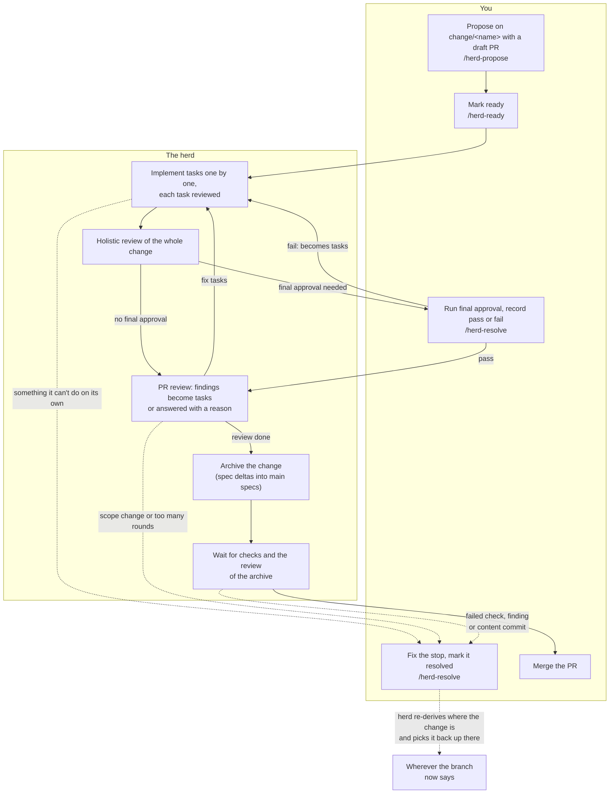

# Using the herd

For the people, and their planner agents, who work in a project the herd serves. It covers what you do and what to
expect. How the herd works inside (states, recovery, containers) is in `design.md`. Each project's own workflow doc
adds that project's rules: what a ready change may need, and how to run its final approval.

The herd isn't built yet. This describes it as designed.

## The life of a change

**Every change lives on its own branch, `<branch_prefix><name>` (usually `change/<name>`), from its first proposal
commit until it is merged.** The default branch gets a change only as one merge, code and archive together, so its
`openspec/changes/` holds only `archive/` and its specs describe only what is built.

1. **You propose** the change on its branch, with a draft PR (`/herd-propose`).
2. **You mark it ready** (`/herd-ready`). From then on the herd owns it.
3. **The herd** implements `tasks.md` item by item on the branch, has each task reviewed, runs the project's gate,
   reviews the whole change, and updates the draft PR.
4. **You run final approval**, if the project has one, and record the result.
5. **The herd** marks the PR ready for review and follows up on what reviewers say, until nothing is open.
6. **The herd** archives the change as the last change to the proposal's own files. **You merge it.**

Your time goes to steps 1, 2, 4 and 6, and to any `needs-human` stop along the way.

## Proposing

`/herd-propose <name>` creates the branch from an up-to-date default branch, in a worktree so your main checkout
stays where it is. Before proposing, it lists the other changes in flight, so you can spot overlaps. If the new change
needs another one merged first, record it in the change's `.openspec.yaml`: `depends_on: [<other-change>]`. It then
runs the project's propose workflow, commits, pushes and opens a **draft PR**. The proposal is reviewed there, and
refining it is more commits on the branch.

Never commit a proposal to the default branch.

## Before marking a proposal ready

The herd implements what's written and can't ask questions, apart from stopping at `needs-human`. `/herd-ready`
checks these rules, and the project's workflow doc adds its own:

- **The proposal validates** (`openspec validate <change> --strict`) and is complete.
- **Each `tasks.md` item is one reviewable commit**: one coherent step that leaves the gate green, small enough for
  one review. Split items that aren't; merge items that can't pass the gate on their own.
- **Sections are in dependency order.** Tasks run strictly in sequence.
- **Nothing needs a capability the project lists as missing** (the manifest's `missing_capabilities`), and no task
  *runs* the final-approval checks. Tasks may write or update those tests; running them is your final approval.
- **Outside content is committed with the proposal** (test fixtures, sample files) where it can be, so the herd
  doesn't stop and ask for it.
- **No task needs a secret.**

## Marking ready

`/herd-ready <name>` checks the proposal, then sets `ready: true` in the change's `.openspec.yaml` on its branch,
commits and pushes. The herd picks it up on its next pass. A change whose `depends_on` changes aren't merged yet
waits for them, then starts by merging the default branch in.

After that, don't apply the change yourself.

## Revising a ready change

Set `ready: false` on the branch. The herd stops after the step it's on. Make your changes, and set it back to
`true`; the herd carries on from whatever the files then say.

If you push while the herd is working, its own next push is rejected and that step is redone from your commit.
Nothing you push is lost.

## Working in herdr

Run `herd`. It opens herdr, or attaches to it, and warns you if the herd itself has stopped running. The herd runs
as its own system user, and keeps running when you close the terminal or reboot. `herd <project>` takes you
straight to a project.

- **The `herd` workspace** has the status pane: every change in flight with its state, current task, review round
  and spend. What's waiting on you (`needs-human`, or final approval with its instructions) comes first, and
  changes still being drafted are listed too.
- **Each project has a workspace**, opened in your checkout of it:
  - **Your planner pane**: your agent (Claude Code by default), where you propose, mark ready and resolve stops.
    The herd never touches it; herdr resumes it after a restart.
  - **One pane per running step**, showing that worker's log. They're read-only; the workers aren't interactive.
  - **An attention pane for each change waiting on you**, highlighted by herdr, saying what's wrong and what to run
    in your planner pane.

`herd status` shows the same list in any terminal. When you're not attached, alerts about what's waiting on you
reach you by desktop notification or push, as the operator set up.

## When the herd asks for you

The herd stops at `needs-human` instead of looping when it can't continue on its own. The stop names its reason:

- a task was rejected in review too many times;
- the change kept growing tasks past the cap, so the proposal itself needs revisiting;
- a step kept failing (the worker crashed, timed out or couldn't get the gate green) past the allowed attempts;
- a required CI check kept failing before the archive, after the herd merged the default branch in or otherwise;
- a required CI check never reported a result within the configured timeout (before or after the archive);
- merging the default branch into the change conflicts;
- the holistic review raised something that doesn't map to a task;
- PR review didn't come clean within the allowed rounds, or a reviewer asked for a change of scope;
- a task needs something the pipeline doesn't have (a device, a credential, a missing capability, or a change to
  the project's CI workflows or the local actions they use, which the herd isn't allowed to make);
- something went wrong after the change was archived (a failed check, a review finding, or a new commit that
  needs review), when fixing it would mean un-archiving;
- a task needs a file from outside the project.

Fix it on the branch (edit `tasks.md`, resolve the conflict, revise the proposal) and mark the stop resolved.
`/herd-resolve <name>` shows the reason, helps with the fix and commits the resolution. The herd picks the change
back up on its next pass.

**A requested file** is best committed to the branch, at a path inside the project, with a line in the change's
`inputs.md` saying where it came from. If it can't live in the repo (too large, licensed, not to be published), run
`herd provide <project> <change> <file>...` instead. The herd mounts it read-only for that change's workers only.
Never provide a credential this way: a task that needs a secret stays with you.

## Final approval

Some projects have a check the herd can't run, typically end-to-end tests that need an emulator, a device or a GUI.
When a change reaches it, the draft PR (and the status pane) shows the project's instructions.

Check out the branch, follow the instructions, and record the result with `/herd-resolve`, which pins it to the
commit you tested:

- **pass**: the change moves on to review;
- **fail**: describe the failing check and what happened. The herd turns it into new tasks, and the draft PR just
  gets more commits.

## Review

After final approval, the herd marks the PR ready for review. Automated reviewers (Copilot, for example) review it
again after every push. Checks have to pass on the latest commit, but the herd waits for their review of the latest
commit that changes the proposal: neither its own notes nor a clean merge of the default branch that leaves the
proposal's files alone restarts the wait. Each finding is either fixed, as a new task that goes through implementation
and review like any other, or answered with a reason for not changing anything. The herd posts the reply and resolves
the thread.

You can review too: your comments are handled the same way. A request to change the change's *scope*, rather than
its implementation, comes back to you as a `needs-human` stop, because scope is the proposer's call.

## Merging

Once review is done, the herd archives the change (syncing its spec deltas into the main specs) as the last change to
the proposal's own files. Normally only the herd's own notes, or a clean merge of the default branch that leaves the
proposal's files alone, follow it; anything else after the archive (a merge that touches the proposal's files, a
failed check, a review finding, or any other commit that changes content; a notes-only commit, yours included, doesn't
count) stops the change at `needs-human`, because fixing it would mean un-archiving. When the checks pass and the
archive has been reviewed (or the automated reviewer didn't answer within the configured timeout), the change is ready
to merge, and **you merge it**. If the default branch has moved on, the herd merges it into the change branch first. A
conflict there stops at `needs-human`.

## After merge

- The herd deletes the merged change's branch.
- `/herd-propose` and `/herd-resolve` remove your worktrees whose branch was merged exactly as it is locally. A
  worktree with uncommitted changes is kept, and they ask you about it.
- **A PR closed without merging keeps its branch**, since it may be reopened or reworked. It's removed only when you
  say the change is abandoned (`/herd-resolve`).
